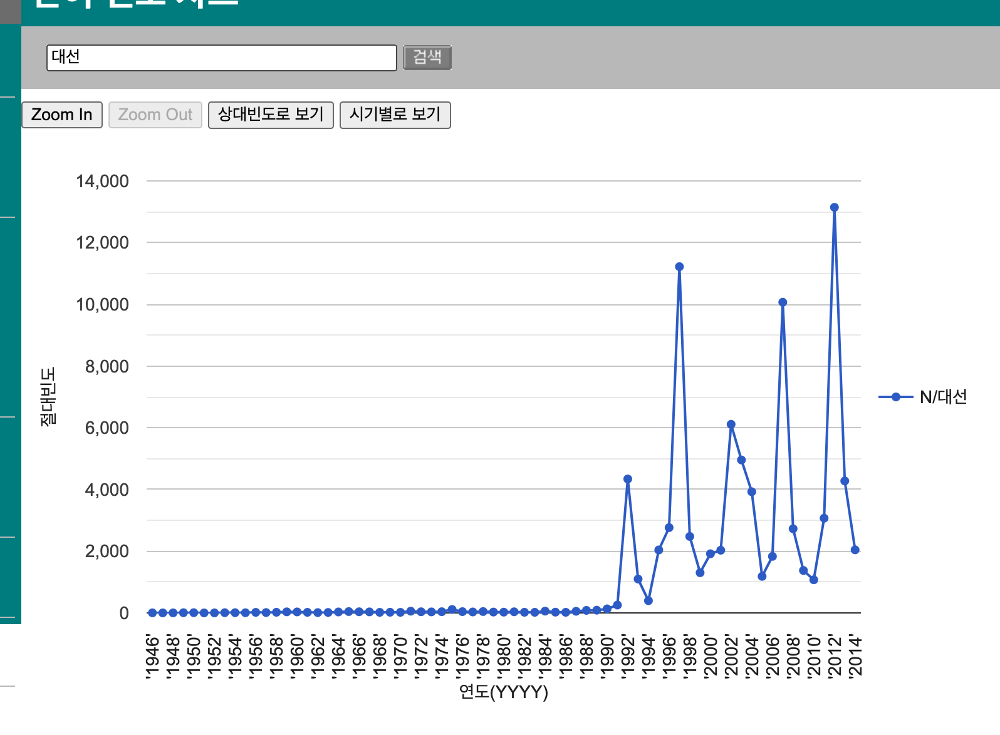
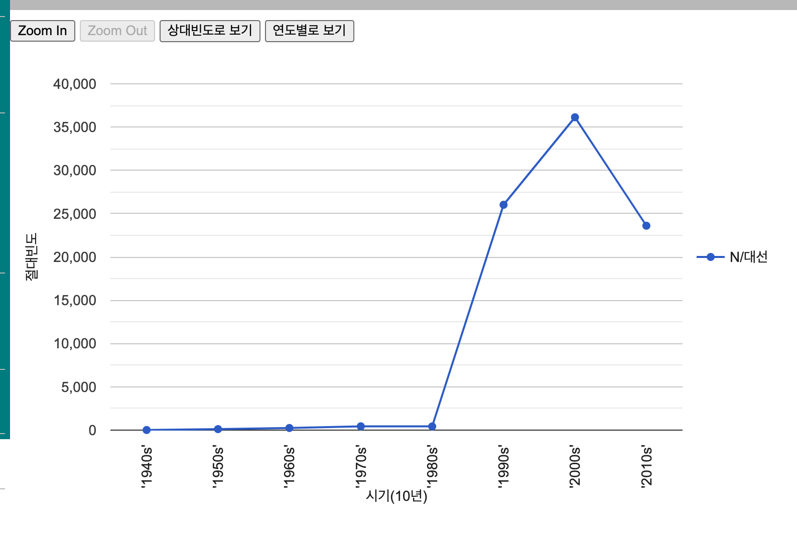
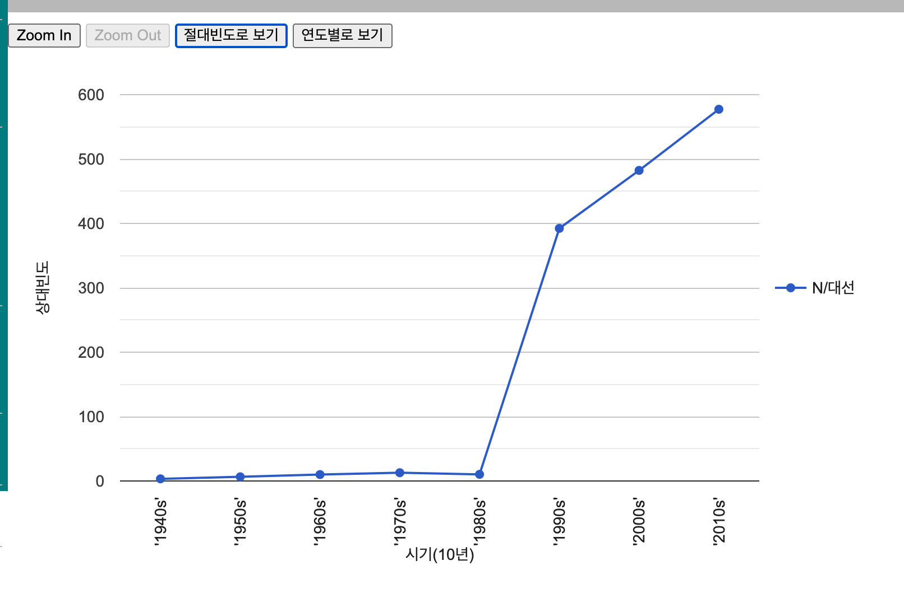
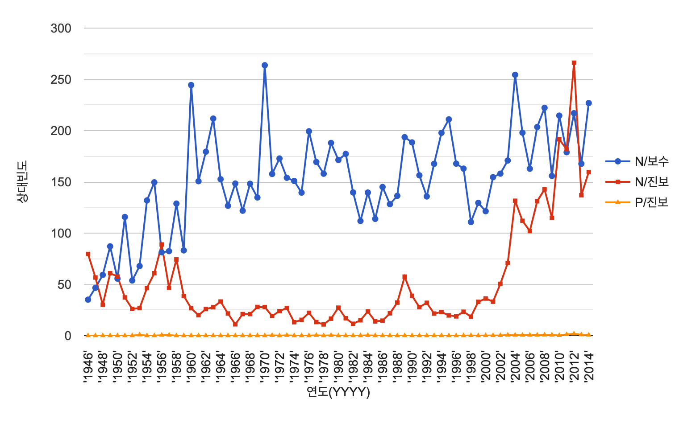

## 東亜日報コーパスの使い方

ここでは，高麗大学（고려대학교）[民族文化研究院（민족문화연구원）](https://riks.korea.ac.kr/)が開発・公開している検索ツールのうち，동아일보 코퍼스（東亜日報コーパス）を検索できる[웹 기반 코퍼스 분석 도구（ウェブベースコーパス分析ツール）](http://corpus.korea.ac.kr/donga/)（以下「分析ツール」）の利用方法についてまとめます．

検索結果の数や例を提示しますが，本文執筆時点での結果であることをお断りしておきます．

東亜日報コーパスの概要についてはウェブページにあまり情報がなく，東亜日報の記事（2018年8月14日付け）「[분석 틀 ‘동아일보 코퍼스’는 1946년이후 기사 260만건-4억어절 분석… 특정 단어 출현빈도-동반등장 단어 추출](https://www.donga.com/news/Culture/article/all/20180814/91504067/1)」を参照してもらうのがよいと思います．

分析ツール自体の使い方は물결21コーパスを検索する「[웹 기반 코퍼스 분석 도구（ウェブベースコーパス分析ツール）](http://corpus.korea.ac.kr/donga/)」とほぼ同じです．なので，具体的な使用方法は[コーパス分析ツールの使い方](../korea/trend21)を参照してください．

この文書では，물결21コーパスで使えなかった「単語頻度」に関する機能を紹介します．

## 単語頻度の分析

気をつけなければいけないのが，基本的に名詞の単語頻度が計算される，ということです．用言の語幹や副詞を入力しても，同音異義語に名詞があれば名詞の，なければ検索結果なし，と処理されます．

また，名詞の場合も同音異義語の区別がされません．意味解析はされていないので，結果の検討に注意してください．

なお，絶対頻度と相対頻度によるグラフ表示が可能ですが，相対頻度は100万語当たりの出現頻度で計算されているそうです（김일환 2019:341）

グラフに表示される頻度数と，実際の検索結果における頻度とが一致しない，というところも注意してください．

### 単一の検索語

左側のメニューから「단어 빈도 차트（単語頻度チャート）」を選ぶと，検索語を入力する画面が表示されます．例として，大統領選挙の略語である「대선」を入力して検索すると，以下のような結果が表示されます．

グラフを見ると，1990年頃までは例が少ない（1990年の絶対頻度は131，1991年は255）ですが，1992年に急増します．これは1992年12月に第14代大統領選挙があったためですが，それまでは略語の「대선」をあまり使わなかったようです．
その後は，大統領選挙の行われる5年ごとに頻度が増大していることが分かります．
この傾向は相対頻度で見ても，あまり変わりません．グラフの上にある「상대빈도로 보기（相対頻度で見る）」というボタンを押すと相対頻度によるグラフに変わりますが，2002年は選挙のあった他の年に比べると，かなり少なくなっています．「대선」という単語が使われだしたと見られる1992年と，ほとんど変わりません．どんな理由があるか，より詳しく調べて見る必要があるでしょう．

初期表示としては年ごとの頻度数が表示されますが，グラフの上にある「시기별로 보기（時期別に見る）」というボタンを押すと，1980年代，1990年代など10年ごとの区切りで表示することができます．先ほどの「대선」のグラフですが，これを時期別の表示にして絶対頻度をみると，1990年代に大きく増えて2000年代に頂点に達し，2010年代はやや減少しています．

しかしこれを相対頻度で見てみると，2000年代，2010年代と続けて使用が増加していることが分かります．

この理由として，「2010年代」と言っても，コーパスのデータが2014年までしか含まれておらず，10年分揃っている2000年代と比べると，2010年代は全体の文節数が少ない可能性が挙げられます．2000年代には2002年，2007年と2回の大統領選挙があり，選挙1回の2010年代に対し絶対頻度では大きく上回るものの，全体の文節数が少ない2010年代のほうが，相対頻度にすると高くなる，ということなのでしょう．

なお，グラフの項目をクリックすると，その年代の用例を検索した結果が表示されます．
上記の例で，時期別に表示した際の1980年代のポイントをクリックしてみると，用例が表示されます．これは「용례검색기（用例検索器）」で検索する際に，「시기별（時期別）」ドロップダウンリストで「1980년대」を選んだのと同じ結果です．

1980年代における「대선」の用例は，「大統領選挙」はあまり多くありませんが，以下のような例がありました．ざっと見たところ，1987年頃の例が最初のようです．

- ｜지난 87년의 **대선**과 13대 총선 등 양대 선거로 지역감정의 골이 더 넓고 깊게 파였다는 우려의 소리가 눞고 또 정치 지도자에 대한 비난도 \| 。（D19891225_130）
- **대선**과 총선 당시 홍보용으로 대대적으로 이용하고 다시 영종도등에 부동산 투기를 부채질하고 있는데 대해 누가 책임질 것인가。（D19890524_081）
- 『우리당도 **대선**직후 부정선거백서까지 발간했지만 노정권의 실체를 부인하자는 것은 아니며 문제는 5공 청산과 민주화가 노정권의 사명이라는 점에서 정통성 인정을 유보하고 있는 것』이라고 설명。（D19890626_075）
- 그 뒤 국민들의 힘으로 6·29라는 역사의 전기를 맞이한 후에도 야권 통합 실패로 **대선** 참패를 당했으며 아직까지도 구태의연한 정치놀음으로 실망감을 안겨주고 있다。（D19891220_004）
- 『정부 여당 스스로 지난 **대선**때 어려운 국면을 맞아 국민들에게 한 약속인 만큼 그 약속은 지켜야 됩니다。（D19881227_121）
- 반면 권씨는 「권로갑의 당선은 곧 김대중의 당선」이라며 **대선**때 몰린 「김대중표」를 지킨다는 전략。（D19880409_118）
- 또 **대선** 참패의 쇼크에만 매달려 있다（D19871222_079）

また，以下のような誤りも見られます．

- WHO 과 **대선** 전에 쐐기：「과대 선전（誇**大宣**伝）」の分かち書き誤り
- 일부**대선** 강경주장\| 결론 쉽게 안나：「일부 대학에서는」の縮約
- 세종**대선** 23명 무더기 제적：「세종대에서는」の縮約
- 김의명의 꿈은 다름 아닌 장훈과 같은 **대선**수가 되는 것。：「大選手が」の誤解析
- 그러나 소련이 동구에 대하여 「브레즈네프 독트린」을 포기했고 그 **대선**「시내트라 독트린」을 적용하여 제 갈 길을 가라 했고 이제 미국과 적극적으로 데탕트를 성공시키고 있는 것은 한반도에서도 냉전을 종식토록 하는 압력이 된 것이다。：「대신」の誤り？

一番多いのは「대선주조」（大鮮酒造）の用例かもしれません．スポーツチームもあり，企業情報もあり．

- 이는 전날 여자 A조의 **대선**주조가 조폐공사를 격파한 데 이어 이번 대회 두 번째 이변이다。（D19840330_130）
- **대선**주조 두산 산업 등 7개 회사의 기업공개를 위한 주식공모 결과 농축수협 접수분을 제외하고도 11·61대1~67·37 대 1의 높은 경쟁률을 보였다。（D19881217_132）

単語頻度の分析を利用する場合，上記のように同音異義語が含まれている点に注意しなければなりません．ざっくり傾向を見たい，というときには便利だろうと思われます．

### 複数の検索語

複数の語を入力して，その趨勢を比較することも可能です．検索語は半角スペースで区切ってください．

ここでは例として「보수（保守）」と「진보（進歩）」の推移を比べてみましょう．「`보수 진보`」と入力した結果について，相対頻度のグラフを示すと以下の通りです．

今度のグラフには「N/보수」「N/진보」に加え，「P/진보」という項目がありますが，これは固有名詞としての項目です．

> 固有名詞の「진보」って何だ，と思うかもしれませんが，「**진보**민주당」「**진보**사회당」「**진보**정의당」など，政党名に含まれるものがマークされています．

それはさておき，朝鮮日報，中央日報とともに「조중동」の一角をなす東亜日報だけに，「보수」の頻度がコンスタントに「진보」を上回っていることが分かります．もちろん，この「보수」には「保守」だけでなく「補修」「報酬」などの同音異義語が含まれていることに注意が必要です．

- 문공부의 이에 대한 사업 계획을 보면 전국 곳곳에 흩어져 있는 유물 발굴조사를 하는 한편 유형문화재의 **보수** 및 복원공사를 서둘러 칠이 연도까지 불국 사 행주 산성 도 산 서원 등 십삼개 문화재의 옛 모습을 찾을 것이라고 한다。（D19700120_019）
- 어떻게 하면 일을 덜하고 **보수**는 많이 받아 윤택한 생활을 할 것인가 하고 생각한다。（D19700101_003）

上記のグラフで注目すべきは，2011年から2012年にかけて，「진보」の相対頻度数が「보수」を上回っているという点です．2012年は[20年ぶりに総選挙と大統領選挙が同年に行われる年](https://ko.wikipedia.org/wiki/%EB%8C%80%ED%95%9C%EB%AF%BC%EA%B5%AD_%EC%A0%9C19%EB%8C%80_%EA%B5%AD%ED%9A%8C%EC%9D%98%EC%9B%90_%EC%84%A0%EA%B1%B0#:~:text=19%EB%8C%80%20%EA%B5%AD%ED%9A%8C%EC%9D%98%EC%9B%90%20%EC%84%A0%EA%B1%B0%EB%8A%94%2020%EB%85%84%EB%A7%8C%EC%97%90%5B5%5D%20%EC%B4%9D%EC%84%A0%EA%B3%BC%20%EB%8C%80%EC%84%A0%EC%9D%84%20%EC%B9%98%EB%A5%B4%EB%8A%94%20%ED%95%B4%EC%9D%B4%EC%9E%90)だったということ，また통합진보당や진보신당，진보정의당など名前に「進歩」のついた政党が活発だったこと，などが理由として挙げられるかもしれません．

なお，1946年も「진보」が「보수」を上回っていますが，政治理念としての「진보」ではなく，「科学技術の進歩」といった意味の使用がほとんどです．

- 우리가 가지고 있는 **진보**(進步)된 기술(技術)을 조선(朝鮮)이 습득(習得)하기를 희망(希望)한다。（D19460806_032）
- 원자력(原子力)에 대(對)한 연구(硏究)는 날로 **진보**(進步)되고 있는데 이것은 일부국가(一部國家)에 국한(局限)되는 것이며 아직 국제화(國際化)하지 못하고 있는 것이다（D19460808_011）

1947年には，政治理念に関する用例が出てきます．

- 이 **진보**(進步)와 반동(反動)이라는 용어(用語)가 일반(一般)에게 만히 씨운다는 것은 전술(前述)한 바와 같거니와 그 중(中)에서도 좌익공진영(左翼共陣營)에서 가장 만히 쓰며 즐걱 이 진보적(進步的)이라는 말과 반동적(反動的)이라는 말을 쓰랴는 경향(傾向)이 농후(濃厚)한 것이 사실(事實)이다。（D19470121_031）

ただし，全ての記事をデータ化しているわけではないので，「これが初出」というのは難しそうです．

## 終わりに

동아일보 코퍼스（東亜日報コーパス）の利用方法については以上です．こちらも残念ながら，検索結果を手軽に保存，というわけにいきません．それでも，一つのメディアに限定して，半世紀に渡るデータを検索・視覚化できるというのは利用価値が高いと思われます．つづりの違う語の出現様相を比較する，などといった利用もできるでしょう．

## 参考文献

- 김일환(2019), '신문 빅데이터 기반의 언어 계량과 시각화', "언어와 정보 사회" 제38호, 서강대학교 언어정보연구소.
