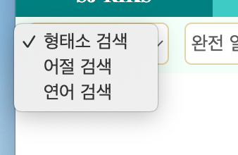
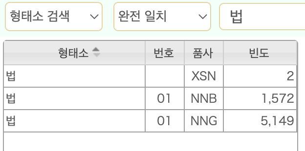
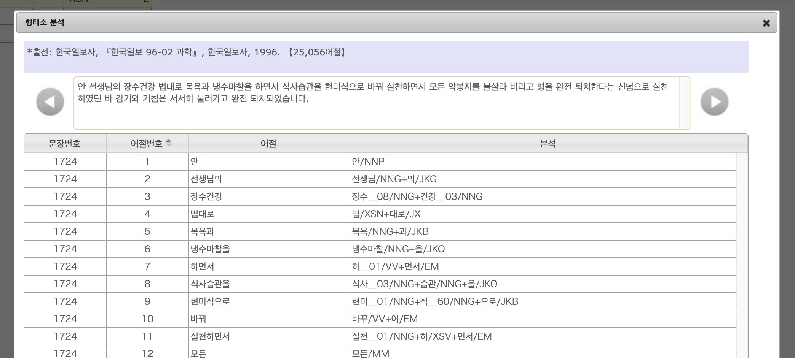
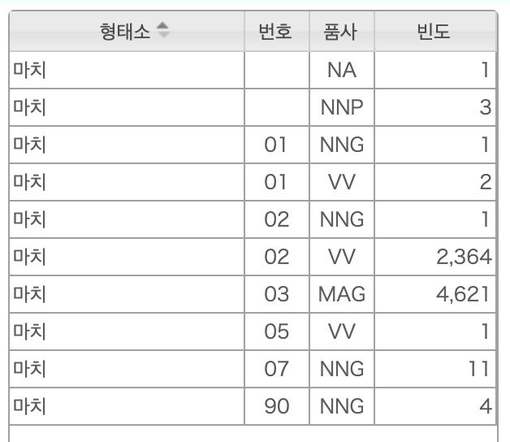

## 現代韓国語用例検索器の使い方

ここでは，高麗大学（고려대학교）[民族文化研究院（민족문화연구원）](https://riks.korea.ac.kr/)の[デジタル人文学センター（디지털인문학센터）](https://riks.korea.ac.kr/organization/digitalhumanities)を通して公開されている検索ツールのうち，SJ-RIKSコーパスを検索できる[현대한국어 용례검색기（現代韓国語用例検索器）](http://riksdb.korea.ac.kr/)の利用方法についてまとめます．

検索結果の数や例を提示しますが，本文執筆時点での結果であることをお断りしておきます．

SJ-RIKSコーパスの概要については[高麗大コーパスの使い方](overview_korea)や김일환·이도길·강범모(2010)などを参照のこと．「検索器」ページの右の方にある「일러두기」にも詳細な説明があり，検索の仕方も含め参考になります．

## 検索に先立って

ここではSJ-RIKSコーパスと，SJ-RIKS拡張版（SJ-RIKS ext.）コーパスとを区別せずに扱います．検索における両者の違いは規模（文節数）と，ジャンル別の検索をするかどうか，という点です．SJ-RIKS拡張版コーパスでは，常にジャンルを特定して検索を行います．

また，[延世大のコーパス](../yonsei/overview_yonsei)とは異なり，検索結果を一発で保存する方法がありません．残念ながらコピー＆ペーストを繰り返すしかないかと．

> この辺りは割り切って，한마루2.0を使って21世紀世宗計画のコーパスを検索・保存する，というのもアリかもしれません．

気をつけないといけないのが，21世紀世宗計画の形態・意味コーパスとは形態素の区切りが異なることです．特に，21世紀世宗計画では割と細かく形態素解析していたのが，直感に合うような形で，1つの形態素としてまとめられているものが多くあります（김일환·이도길·강범모 2010）．その最たるものが接尾辞ですが，例えば「과학적（科学的）」という文節を21世紀世宗計画では「과학/NNG+적/XSN」のように分けていたのですが，SJ-RIKSコーパス（拡張版含む）では「과학적/NNG」として，一つの普通名詞にしています．

上記の点を勘案の上，以下の内容に進んでください．

[リンク](http://riksdb.korea.ac.kr/)から「検索器」に進むと，以下の画面が表示されます．

一番左のドロップダウンリストで検索の対象＝形態素，文節，連語を選びます．

2番目のドロップダウンリストは，形態素検索と文節検索の場合は検索の際の「一致」方法＝前方一致，完全一致，後方一致を，連語検索の場合は検索する構成＝句構成，隣接構成，文構成を選ぶためのものです．

それでは，それぞれの検索について，ドロップダウンリストの順に沿って見てみます．基本的にはSJ-RIKSコーパスを例にしますが，適宜SJ-RIKS拡張版についても触れます．

## 形態素（형태소）の検索

デフォルトの設定---「형태소 분석（形態素検索）」＋「완전 일치（完全一致）」で検索を行ってみましょう．例えば検索語に「`법`」と入力し，リターンキーを押すか，「검색（検索）」ボタンをクリックします．すると左側に候補のリストが頻度付きで一覧表示されます．「번호（番号）」は同音異義語を示したもので，『標準国語大辞典』に沿っています．

> ただし，ウェブ版の方は番号付けの改訂が行われたので，合わない場合もあります．

この例では，品詞の異なる候補があります．目当ての項目の行をクリックすると，その右側にKWIC形式で用例が30例ずつ表示されます．
さらに，用例の各行をクリックすると，今度はその用例が含まれる文全体に加え，その解析内容まで表示されます．「법/XSN」の最初の例を見てみます．

上記画像のように出典まで表示され，さらに原文の左右にある「＜」「＞」を押していくと，他の文も解析結果付きで見ることができ，前後の文脈を確認できて便利です．

なお，用言を検索する際は語幹だけを入力します．例えば動詞の「마치다」を検索したい場合，検索語に「`마치`」だけを入力してください．

今度は候補が多いですが，「番号」が「90」となっているのは，『標準国語大辞典』にない項目です．実際に例を見ると，日本語の「町」だったり，英語の「much」や「March」だったり，でした．

ここで番号が「02」，品詞が「VV」となっている項目を選ぶと，動詞「마치다」を含む文節が検索例として表示されます．

### 完全一致・前方一致・後方一致

上記では「完全一致」検索ということで，検索語と完全に一致する形態素だけが検索されました．それに対し，「전방 일치（前方一致）」は検索語から始まる形態素が検索され，「후방 일치（後方一致）」は検索語で終わる形態素が検索されます．検索語「`당하`」を例に，候補がどのように変わるか見てみましょう．

|   完全一致   |   前方一致   |   後方一致   |
|------------|------------|------------|
|  당하_/XSV  |  당하_/XSV  |  당하_/XSV    |
|  당하_01/NNG  |  당하_01/NNG  |  당하_01/NNG  |
|  당하_01/VA  |  당하_01/VA  |  당하_01/VA   |
|  당하_01/VV  |  당하_01/VV  |  당하_01/VV   |
|            |  당하관_/NNG  |            |
|            |  당하리_/NNP  |            |
|            |              |  가당하_/VA  |
|            |              |  간당간당하_/VV  |
|            |              |  당당하_/VA  |
|            |              |  맞당하_/VV  |
|            |              |  부적당하_/VA  |
|            |              |  부정당하_/VA  |
|            |              |  온당하_/VA  |
|            |              |  적당하_02/VA  |
|            |              |  정당하_01/VA  |
|            |              |  정정당당하_/VA  |
|            |              |  지당하_/VA  |
|            |              |  타당하_/VA  |
|            |              |  합당하_01/VA  |
|            |              |  황당하_/VA  |

上の表では対比をしやすいよう，順序を入れ替えてありますが，実際には가나다順で表示されます．前方一致も後方一致も含む「部分一致」のような検索ができると，上記を一発で検索できるのですが，それはないので，検索語を**含む**形態素を探す場合は，前方一致と後方一致の両方を検索するのがよいでしょう．

### 注意が必要な点

基本的には21世紀世宗計画コーパスが元なので，品詞タグもそれにならっていますが，[高麗大コーパスの使い方](overview_korea#물결21(Trend21))にも書いたように，接続形語尾（연결어미＝EC）と終止形語尾（종결어미＝EF）とをまとめて，「어말어미（語末語尾）」＝EMとしているなど，いくつかの変更があります．項目を選ぶ際に注意しましょう．

また，タグ付けのゆれなども散見されますので，用例の確認は必須です．

## 文節（어절）の検索

「어절 검색（文節の検索）」は，1つの文節だけを対象に検索を行います．「完全一致」では検索語と全く同じ形の文節にマッチします．「前方一致」は検索語で始まる文節が，「後方一致」は検索語で終わる文節がマッチします．特定の形を検索したい場合には，こちらの方が便利でしょう．

試しに検索してみましょう．「어절 검색」を選び，「완전 일치」のままで，検索語を「고프」とします．そうすると，「고프」だけで構成される文節はないでしょうから，検索結果がないと表示されます．

次に，検索語は変えずに「전방 일치」にして検索しましょう．そうすると，今度は「고프」で始まる「고프거나」「고프겠지」「고프고」などの候補が表示されます．ただし，用言の「고프다」の活用形だけでなく，「고프바초프는」のような例も検索されます．「고프」で始まる文節だからです．

今度は「후방 일치」で検索してみましょう．そうすると「벨로노고프」「센차고프」の例が出てきます．

こちらも「部分一致」のような検索ができないので，「○○」を**含む**文節を検索，といった場合，前方一致と後方一致のどちらも行う必要があります．

## 連語（연어）の検索

2つの形態素について，入力した順序に現れる用例を検索します．検索語に，2つの形態素をスペースで区切って入力します．単語ではなく形態素を検索するので，用言については語幹の形を入力し，体言の場合は助詞をつけないようにしてください．

なお，検索には時間がかかります．連体形語尾「-을」と形式名詞「수」のように，非常に用例が多い場合はサーバーが処理しきれず，エラーが帰ってくることがあります．
また，サーバーへの負担から，検索の範囲を1000個に制限しているとのこと（일러두기より）．

形態素の検索，文節の検索とは異なり，連語の検索では検索の範囲を指定します．以下の3種類です．

|  検索の範囲指定  |  検索される範囲  |
|--------------|---------------|
|  인접 구성（隣接構成）  |  形態素間の距離が1文節以下．分かち書きされていない例も検索されるよう，2つの形態素がっ同一文節に現れる場合も含まれる．  |
|  구 구성（句構成）  |  形態素間の距離が1文節以上4文節未満．  |
|  문장 구성（文構成）  |  形態素間の距離に制限を置かず，同一文内に現れる2つの形態素を検索する  |

延世コーパスの[連語の検索](../yonsei/written_2)は1つ目の検索語を1番目として，その直後が2番目，その次が3番目，という数え方でしたが，こちらは1つ目の検索語を0番目として数えることになります．

|  コーパス  |  1文節目  |  2文節目  |  3文節目  |  4文節目  |  5文節目以降  |
|:--------:|:--------:|:--------:|:--------:|:--------:|:--------:|
|  연세 문어 균형 말뭉치  | 検索語1  |  2어절  |  3어절  |  4어절  |  範囲外  |
|  SJ-RIKS 인접 구성  | 検索語1 検索語2  |  検索語2  |<--| -- 範囲外 --|--> |
|    SJ-RIKS 구 구성  | 検索語1 | <-- | -- 検索語2 -- |-->| 範囲外 |
|    SJ-RIKS 문장 구성  |  検索語1 検索語2  | <--| -- 検索語2 --| --- | --> |

以下，「`학교 내`」（학교と내の間に半角スペース）という検索語で，それぞれの例を示してみたいと思います．

### 인접 구성（隣接構成）

同一文節もしくは1文節（隣の文節）まで．

- 학교/NNG 내/VX：
  - 그러니 **학교에** **갖다낼** 관광버스 삯이 있을 리 없었다.
- 학교/NNG 내_09/NNB：
  - 미 대사의 **학교내** 강연회 개최 사실을 알고
  - 일곱째, **학교내에서** 단체로 행하는 신체검사,
  - 배에다 힘주며 돌아다니던 **학교내의** 주먹들하고는 전혀 어울릴 줄을 몰랐으며,

「1文節**以下**」ということなのですぐ隣の文節までが範囲になるはずなのですが，形式名詞「내（内）」との共起は同一文節に現れる例しか含まれていませんでした．「○」がついているのは，その文節に検索語2がある例が検索結果に出てきたことを指します．「検索語1と同じ文節」にだけ「○」がついている場合は，隣の文節に検索語2が含まれる例が検索されなかったことを指します．

#### 実験

隣の文節が含まれるかどうか，ちょっと挙動が分からないので，いくつか実験をしてみました．

|  検索語  |  検索語1と同じ文節  |  隣の文節  |  備考  |
|:-------:|:--------------:|:--------:|:-----|
|  `나이 먹`  |  ○  |  ☓  |  「나이먹은」「나이먹어서」「나이먹고」「나이먹어가면서」  |
|  `나이 를`  |  ○  |  ○  |  「나이를」「젊은 **나이**에 아기**를**」「사람들은 **나이**에 의미부여하기**를** 좋아한다.」  |
|  `먹 나이`  |  検索結果なし  |  |  |
|  `물구나무 서`  |  検索結果なし  |  |  |
|  `물구나무 를`  |  ○  |  ○  | 「물구나무를」「**물구나무** 서기**를**」「**물구나무** 재주**를**」  |
|  `밥 하`  |  ○  |  ○  ||
|  `기억 하`  |  ○  |  ○  ||
|  `선진 국가`  |  ○  |  ○  ||
|  `시간 동안`  |  ○  |  ☓  |  「1시간여동안」「3시간동안이나」  |
|  `받 겠`  |  ○  |  ○  ||
|  `김치 담그`  |  ○  |  ☓  |  「김치담금법이」の1例  |
|  `소설 읽`  |  ○  |  ☓  |  「소설읽기」  |
|  `읽 소설`  |  ☓  |  ○  |  「읽은 연애소설은」「읽던 연애소설은」「읽는 모험소설이나」  |
|  `차이 크`  |  検索結果なし[^ex1]  ||  |
|  `크 차이`  |  検索結果なし[^ex2]  ||  |
|  `차이 나`  |  △[^ex3]  |  △  |  |
|  `나 차이`  |  ☓  |  ○  |  「1년만 나이차가 **나도** '세대**차이**'를 느낀다는데」の1例  |
|  `좋 사람`  |  ○  |  ○  |  |
|  `사람 좋`  |  ○  |  ○  |  |
|  `년 만`  |  ○  |  ○  |  |

何だか傾向がよく分かりませんが，「名詞―動詞」（という想定の）組み合わせの場合，同一文節に2つの検索語が含まれている用例**だけが**検索されることがある，という感じでしょうか．
とりあえず，ターゲットが隣り合っている例を検索したいときは，この隣接構成の検索と，次の句構成の検索とを行い，重複するものを除く，という手順にするのがよさそうです．

### 구 구성（句構成）

1文節（隣の文節）以上4文節未満．1つ目の検索語をN（中心語）とした場合，N+3までの範囲．

- 학교/NNG 내/NP：
  - 평일의 **학교에서는** **내가** 예상했던 것처럼
  - **학교** 분위기는 **내가** 보기에는 이래도 되나 싶을 정도로 한국과 달랐다.
  - 서로 스스럼없이 대하는 **학교,** 그것이 바로 **내가** 원하는
  - 진학문제로 **학교에** 오셔서야 아버지는 **내가** 명문 고등학교는커녕
- 학교/NNG 내/VX：
  - 그러니 **학교에** **갖다낼** 관광버스 삯이 있을 리 없었다.
  - 그러한 요구의 충족을 보장하는 각서를 **학교측으로부터** 받아 **내려고** 하는 것이
  - 일선 교육청과 **학교현장에서의** 재원누수라도 **막아내야** 한다.
  - 집도 짓고, **학교도** 세우고, 물건도 **만들어내는** 길만이 살 길이다.
- 학교/NNG 내_02/VV：
  - "학기 초에 **학교에** **내는** '가정 환경 조사서'에
  - **학교건립** 성금을 **내고** 방문했던 기억을 떠올렸다.
  - **학교운영재원의** 60%이상을 학생들이 **내는** 수업료로 충당케 한 것부터가
- 학교/NNG 내_09/NNB：
  - 지금 **학교** **내의** 징벌만이 아니라
  - 자유 **대안학교에서는** **학교내** 교사, 학부모, 학생의 역할을 똑같이 중시한다.
  - 사명을 갖고 출발한 민족학급이었지만 **학교** **내·외부적인** 환경은 무척이나 불안정한 상황이었다.
  - 가스정압기가 **학교부지** **내에** 들어선 곳은 13개교이다.
  - 최근 몇몇 학교에서는 **학교부지** **내** 가스정압기 설치 과정에 대해
  - 최근 몇몇 **학교에서는** 학교부지 **내** 가스정압기 설치 과정에 대해
  - 각 **학교에** 시한 **내에** 징계할 것을 지시했다.
  - 내가 속한 작은 공동체 -- **학교** 말이다 -- **내의** 문화 매체에 발표했었다.
  - 이번에 설립된 꾸르실료 봉사자 **학교는** 그동안 부족했던 **교구내** 꾸르실료 재교육을 내실화하기 위한 과정으로

「-(으)ㄹ 수 있다」や「-(으)ㄹ 것이다」のような分析的な形式を検索したい場合は，だいたい3文節までならカバーできるかと思うので，こちらの句構成で検索すればよいかもしれません．ただし，分かち書きの誤りなどがあるので，やはり上記の隣接構成の検索も行っておくのがよいでしょう．

### 문장 구성（文構成）

形態素間の距離を問わず，同一文内を検索．同一文節内も含まれる[^kimchi]．

「`학교 내`」：

- 학교/NNG 내/NP：
  - 평일의 **학교에서는** **내가** 예상했던 것처럼
  - 우리 **학교의** 우수성을 널리 알리고 싶다는 교장 선생님의 의무감(?)에 불타는 전화부터, **내가** 억울한 일을 당했으니
  - 아직 **학교에** 공식적인 사의를 제출하지는 않았지만 몇사람 관리자들과 친한 교사들은 **내가** 곧 학교를 그만둘 거라는 사실을
- 학교/NNG 내/VX：
  - 국립 예술 **학교를** 만들어 어렸을 때부터 좋은 인재를 골라내 국가가 키워 **내는** 것도 한 방안이다.
  - 이러니까 **학교도** 값비싼 물건을 **만들어내는** 공장이 된 것이다.
  - **학교에** 돌아가서 학급신문이나 기타 여러가지를 멋지게 만들어 **내야겠다는** 생각을 하게 되었다.
- 학교/NNG 내_02/VV：
  - 국립중등학교 **#국립학교** 가운데 입학시험을 치는 문법학교(그래머스쿨) #시험으로 선발하고 학비를내는 사립학교로 나뉜다.
  - 월급을 쪼개어 10만원, 100만원의 **학교발전** 기금을 **냈던** 연세대 동문들은
  - 아이들을 학교에 보내지 않고 **학교설립비** 충당을 위해 신설된 교육세도 **내지** 않기로 했다.
- 학교/NNG 내_09/NNB：
  - 교육부문에서는 ▶내국 법인의 **외국인학교** 설립▶해외거주 경험이 없는 내국인의 특구 **내** 외국인학교 입학
  - 이 **학교에서** PTA운동이 불붙기 시작한 것은 70년 9월 이 학교 **내에** 구립 유치원 건설을 둘러싸고
  - 이 학교에서 PTA운동이 불붙기 시작한 것은 70년 9월 이 **학교** **내에** 구립 유치원 건설을 둘러싸고
  - 학부모의 **학교선택권을** 확대하기 위하여 학교군 **내의** 몇 학교에 지원하면

範囲を限定せずに調べたいなら，この文構成を選ぶのが良さそうです．ただ，2つの形態素に何の関連もない例が多く出てくる可能性があるので注意．漏れがないよう，とにかく広範囲に拾って，無関係なものを除外していく作業をしていくのであれば，この方式が無難です．

## 拡張版の検索

ここまではSJ-RIKSの検索について見てきましたが，拡張版（SJ-RIKS Extention）を使って，より多くの例を検索することができます．SJ-RIKSとの違いは，検索の際にジャンルを指定しなければならない点です．

最初の画面で「SJ-RIKS ext.」という部分をクリックすると，拡張版の検索画面になります．基本的にはSJ-RIKSの場合と同じですが，「검색（検索）」ボタンの右に，ドロップダウンリストが追加されます．ここからジャンルを指定します．選べるジャンルは，

- 순구어(전사)＝純口語（転写）
- 준구어(대본)＝準口語（台本）
- 신문＝新聞
- 잡지＝雑誌
- 책(상상)＝本（想像（小説などフィクション））
- 책(정보)＝本（情報（ノンフィクション，教科書，専門書など））
- 책(총류)＝本（総類（辞書など））

となっています．検索のタイプや方法は，SJ-RIKSの場合と同じです．

## 終わりに

현대한국어 용례검색기（現代韓国語用例検索器）の利用方法については以上です．割と手軽に大量の解析済みコーパスを検索できるのは便利ですが，検索結果を簡単に保存できないのが玉に瑕と言えるでしょう．頻度情報を見るには便利かもしれません．

## 参考文献

- 김일환·이도길·강범모(2010), 'SJ-RIKS Corpus: 세종 형태의미 분석 코퍼스를 넘어서', "민족문화연구" 52호, pp.373-403, 고려대학교 민족문화연구원.

[^ex1]:「차이가 크지 않았다.」などの例があることは確認済み

[^ex2]:「큰 차이를」などの例があることは確認済み

[^ex3]: 共起する形態素により若干の違いが見られました．`나/VV`：「차이」と「나다」が同一文節に含まれる「차이나는 경우」「조금 차이나지만」のような例のみマッチ．`나/EM`：「차이가 있나?」のように，隣の文節に「나」が含まれる例がマッチ．`나/JX`：「차이나 있지.」「차이가 55.2%나 됐다.」のように「차이」を含む文節から隣の文節までに「나」が含まれる例がマッチ．

[^kimchi]: 隣接構成の検索で同一文節内の1例だけ検索された「`김치 담그`」を文構成の検索で試したところ，同じ例「김치담금법이」が検索されました．
