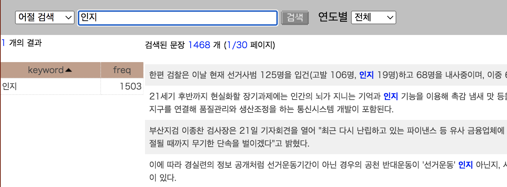
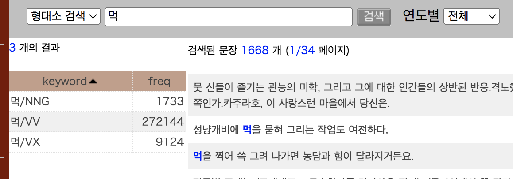
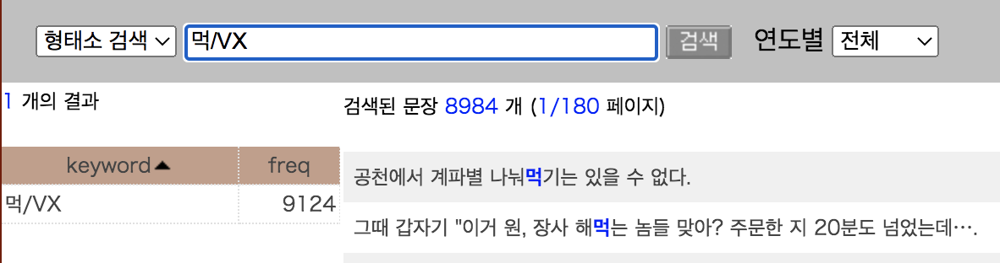
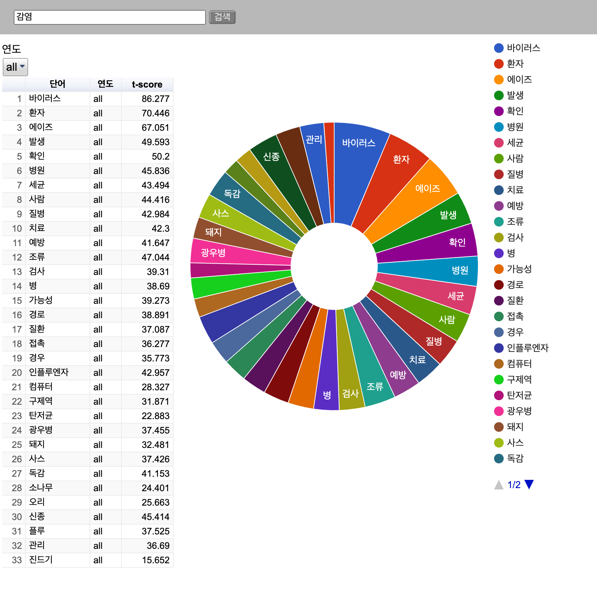
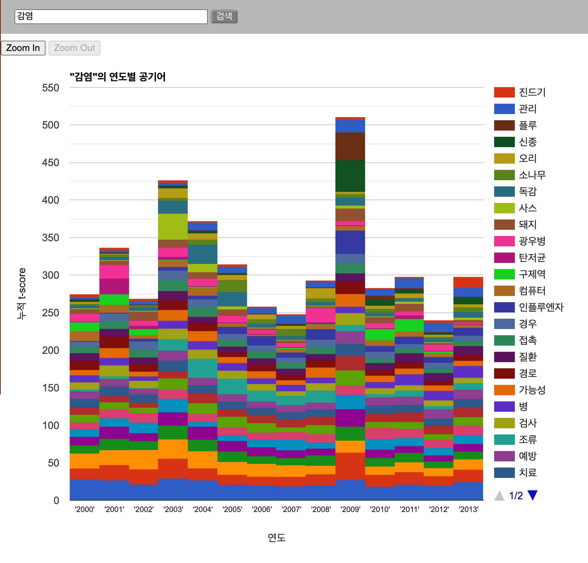
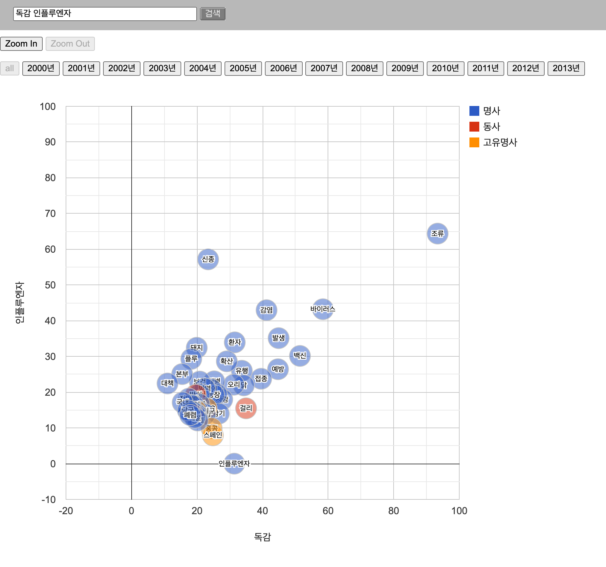
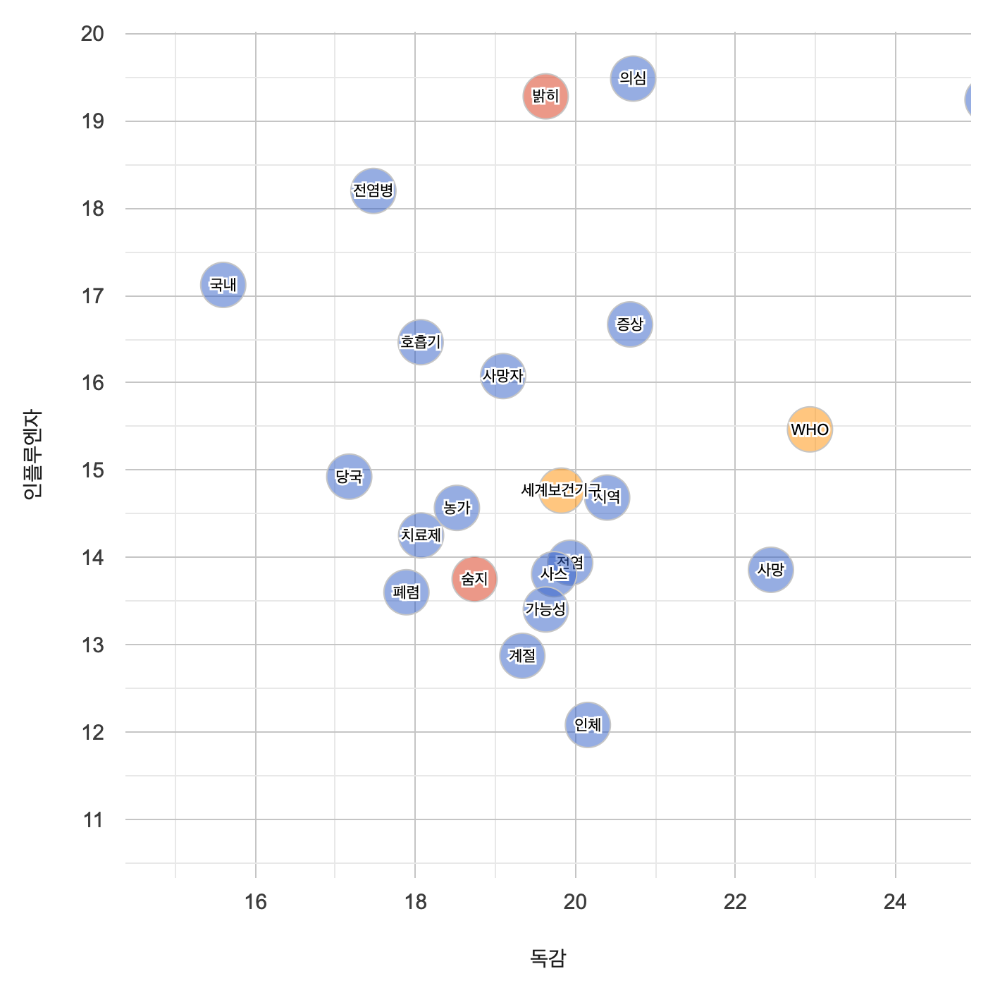
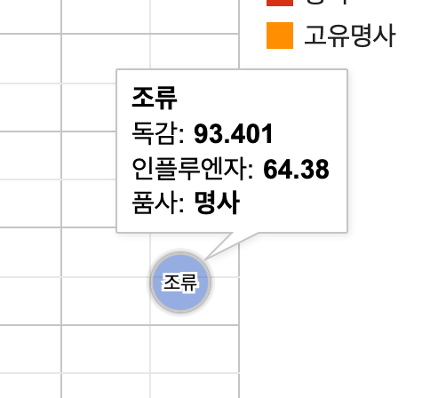
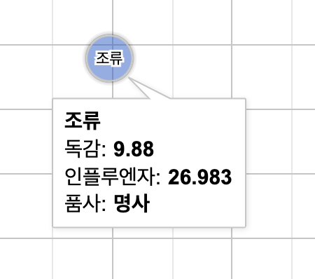

## コーパス分析ツールの使い方

ここでは，高麗大学（고려대학교）[民族文化研究院（민족문화연구원）](https://riks.korea.ac.kr/)の[デジタル人文学センター（디지털인문학센터）](https://riks.korea.ac.kr/organization/digitalhumanities)を通して公開されている検索ツールのうち，물결21（Trend21）コーパスを検索できる[웹 기반 코퍼스 분석 도구（ウェブベースコーパス分析ツール）](http://corpus.korea.ac.kr/)（以下「分析ツール」）の利用方法についてまとめます．

検索結果の数や例を提示しますが，本文執筆時点での結果であることをお断りしておきます．

물결21コーパスの概要については分析ツールの左側メニューより「Trend21 코퍼스」を確認するか，[高麗大コーパスの使い方](overview_korea)，김일환 외(2013)などを参照のこと．分析ツール自体については최재웅·이도길(2014)にも説明があります．

分析ツールには，以下のような機能があります．

- 単語頻度（단어 빈도）
- 共起語の分析（공기어 분석）
  - 年度別の共起語表示・円グラフ（연도별 공기어(Pie chart)）
  - 年度別の共起語表示・積み上げ棒グラフ（연도별 공기어(Area chart)）
  - 共起語の比較（공기어 비교）
- 用例検索（용례검색）

このうち「単語頻度」の「単語頻度チャート（단어 빈도 차트）」は検索語を入力しても「検索結果がありません」と表示され，うまく機能しませんでした．최재웅·이도길(2014:14-16)では図の例などもありますので，そちらを参照してください．以下では「単語頻度」についての説明を省略します．
なお，「単語頻度目録（단어 빈도 목록）」はダウンロードできます．

## 検索に先立って

検索できるのは2000年〜2013年までの記事となっています．ページの説明では2017年までデータを拡充するとありますが，今のところ2013年までのデータが利用できます．

[SJ-RIKSコーパス](sjriks)とは異なり，形態素解析のみ行われています．意味解析は行われていないので，同音異義語が区別されていない点に注意が必要です[^kisa]．また，品詞タグの体系は[SJ-RIKSコーパス](sjriks)と同様です．接尾辞が名詞に含まれた形で解析されているので，21世紀世宗計画の検索結果とは異なる場合があります．

なお，用例数が多すぎるので，全ての検索結果を表示するのではなく，頻度により制約を加えているそうです．左側メニューの「용례검색」から翻訳・引用すると以下の通り．

|  ［対象の］年度  |  形態素の検索  |  文節の検索  |
|:-------:|:-------------:|:-----------:|
|  全年度  |  頻度2以上  |  頻度10以上  |
|  各年度  |  制約なし  |  頻度5以上  |

あと，こちらも検索結果を一発で保存する方法がありません．年度別の比較をする際には，年度ごとに検索して結果をコピー＆ペーストしていくしかなさそうです．「単語頻度チャート」が使えないのは返す返すも残念．また分野ごとの検索もできないようです．

以下では，先に用例の検索，次に共起語関連の機能について見ていきます．

## 用例の検索

左側のメニューから「용례검색기（用例検索器）」をクリックすると，検索画面が出てきます．


「형태소 검색（形態素検索）」と「어절 검색（文節検索）」が可能ですが，基本的に検索の単位は文節です．

「연도별（年度別）」ドロップダウンリストから，検索対象の年度を「전체（全体）」を含め選択することができます．

左側メニューの「용례검색」に詳細な説明が出ていますので，必要に応じて参照してください．

## 文節の検索

### 完全一致検索

インプットボックスに検索語を入力して検索を行いますが，検索語として単に単語や文字列を入力した場合，「완전 일치（完全一致）」検索となり，その検索語だけで**だけで**構成される文節がマッチします．例えば検索語として「`인지`」を検索した場合，文節に「인지」だけが含まれる文が検索されます．



左側には頻度情報が表示され，ここでは1503という結果になっています．右側には検索された用例が出てきますが，上段には「검색된 문장 1468 개（検索された文1468個）」となっていて，頻度情報と合致しません．
これは以下のように，1文に検索語が複数含まれている場合があるためです．

- 때문에 李의장의 '실수' **인지** '고의' **인지** 해석이 엇갈렸다.
- GE는 제품 **인지** 품질·서비스 **인지** 품질·불평률·고객 충성도 같은 평가 항목에서 고른 점수를 얻었다.

上記の例のうち，1つ目の例は「『うっかり』**なのか**『わざと』**なのか**」という文で，指定詞が使われているので，本当は前の「'실수'」につけて，「'실수'인지」で1文節としなければならないはずです．そうであれば「인지」だけで成り立つ文節ではないので，ここでマッチするのはまずいのですが，元の入力が「'실수' 인지」のようにスペースが含まれているため，「인지」だけが文節となり，検索に引っかかったと言えます．

なお，検索された用例のうち，目当ての行をクリックすると，下段にその文の形態素情報が表示されます．「● 원문보기（原文を見る）」をクリックすると，別ウィンドウでその文を含む元記事全体が表示されます．最上部に記事のタイトルがあり，2行目の右端には記事の略号が示されます．

上記のうち，記事の略号については以下の通りとなっています．例として「J20000310_034」を見てみましょう．

|  新聞略号  | 年  |  月日  |  記事番号？  |
|:--------:|:--:|:-----:|:----------:|
|  J  |  2000  |  0310  |  _034  |

新聞略号は「C」＝朝鮮日報，「J」＝中央日報，「D」＝東亜日報，「H」＝ハンギョレ，となっています．

### ワイルドカードを用いた検索

「인지を**含む**文節を検索したい」とか，「인지で**始まる**（あるいは**終わる**）文節を検索したい」という場合には，ワイルドカードを使います．
ここで使えるワイルドカードは以下の通りです．

- `*`：0以上の文字．文字があってもなくてもよい
- `?`：1バイト分の文字

ワイルドカードを使った検索では，検索結果の左側に，マッチした文節がリスト表示され，それぞれの頻度が表示されます．任意の行をクリックすると，検索された文節を含む用例が，右側に表示されます．

なお，ワイルドカードを使った検索ではマッチする文節があまりに多い場合，検索された順に最初の5000個のみ表示されます．頻度順ではない点に注意．

> 左側のリスト表示で「freq」をクリックすると頻度順にソートできるのですが，リストが5000を超えている場合にソートすると，表示される5000個の中でソートしているのか，それ以外の項目も含めてソートしているのか，不明です．前者だと思いますが．

#### 「`*`」の使用例

上記のワイルドカードのうち，`*`については他のコーパス検索でもよく用いられるので，だいたい分かるかと思います．ただし，検索の範囲はあくまで文節です．文節をまたいだ結果は出てきません．いくつか検索の例を見てみましょう．

検索例：0以上の文字(`*`)＋인지　＊いわゆる「後方一致」

```text
*인지
```

結果（一部）：

- **"그래서인지** 오히려 연기 반경이 더 넓을 수도 있겠다.(웃음)"
- 열기가 많은 **가스레인지** 주변에 놓고 쓰면 안된다.
- ■ 자신에게 해당되는 것이 **몇개인지** 세어 보세요.
- **인터체인지** 7곳.터널 13곳.다리 1백4곳이 생긴다.

検索例：인지＋0以上の文字(`*`)　＊いわゆる「前方一致」

```text
인지*
```

結果（一部）：

- 이 때문에 신경과학 **인지과학** 같은 첨단 분야의 기간 학문으로 꼽힌다는 말도 덧붙였다.
- 운동은 **인지기능은** 물론 노화와도 관련이 있다고 한다.
- 이와 관련해 미국이 언제 이를 **인지했는지** 여부가 이 사건의 파장을 이해하는 데 중요한 단서가 될 것으로 보인다.

検索例：0以上の文字(`*`)＋인지＋0以上の文字(`*`)　＊「인지」を含む文節の検索

```text
*인지*
```

結果（一部）：

- **"인지도** 있는 방송인을 출마시켜라."
- 휴대용 **가스레인지에서** 부탄가스로 고기를 구워 먹은 후 불을 끄고 나면 가스통이 차가워진 것을 느낄 수 있다.
- 어느 것이 **먼저인지는** 모르지만 하여간 그렇게 되었다.

最後の例では，上記に加えて「인지」だけで成り立つ文節もマッチします．

#### 「`?`」の使用例

他であまり見られないのが，1バイト分の文字を表す`?`です．「バイト」とは何か，については[IT用語辞典](https://e-words.jp/w/%E3%83%90%E3%82%A4%E3%83%88.html)を見ていただくとして，ここではとりあえず1バイトだと半角英数字や半角記号1文字分，2バイトだとハングルやひらがななどの全角文字1文字分を指す，という程度にしておきます．

上記の`*`だと長さ無制限（ただし文節内に限る）でマッチしてしまうので，「○○に続けてハングル1文字だけあるような例」といった文字数の制限をかけたい場合，こちらの`?`を使うとよいでしょう．

ただ，「1バイト分」というところがミソで，ハングル1文字を表すつもりで「`??`」とすると，半角英数字・記号2文字分の例もマッチしてしまいます．いくつか例を見てみましょう．

|   検索語の例   |   検索される例   |
|--------------|--------------|
| `?씨`        | "씨 / '씨 / A씨 など|
| `?고?`       | "고1 / '고, / '고' / K고, など  |
| `??고?`      | ""고1 / ㅇ고, / 가고" / 가고, / 갚고, / 경고) / 고고! / 들고) / 콩고, / 타고~ など   |
| `????로`     |  ""도로 / "8일로 / '3D'로 / '다'로 / 1.0%로 / 10도로 / 3대7로 / 4~5m로 / 4백%로 / ▶프로 / 강타로 など  |
| `??로??로`   |  AS로마로 / 가로세로 / 가로수로 / 브로치로 / 알로에로 / 원로들로 / 유로화로 / 항로별로 など   |

上記のように，`?`を連続して使うと，バイトの切り方に複数の可能性が生じるので，求める用例かどうかをチェックする必要があります．

`?`と`*`とを組み合わせて使うこともできます．

検索例：일＋2バイト分の文字（`??`）＋일＋2バイト分の文字（`??`）＋0以上の文字(`*`)

```text
일??일??*
```

結果（一部）：

- 이 같은 비리가 빙산의 **일각일지** 모른다는 징후가 많기 때문이다.
- 이 서비스는 우선 컴퓨터에 카메라를 장착해 **일대일로** 문자대화를 나누며 서로의 얼굴을 볼 수 있도록 해준다.
- 라벤더 제라늄 **일랑일랑** 등의 향기 오일을 사용하면 기분 전환에도 좋다.
- 다음은 김 수사과장과의 **일문일답(※는** 독자의 이해를 돕기 위한 설명).
- 이날 영접 장면의 궁금한 점들을 우리 정부 관계자들의 조언을 바탕으로 **일문일답식으로** 정리했다.
- 원시시대에도 **일부일처제가** 있었지만 지금처럼 독점적이지는 않았답니다.
- **일분일초를** 다투며 바쁘게 살아가는 현대인에게 감기는 황금 같은 시간을 빼앗아 가는 '시간 도둑'일 수 있다.
- 그리고 영진전문대 졸업과 함께 대구가톨릭대 **일어일문학** 전공에 편입학했다
- 팀 당 27경기씩, 총 135경기가 수요일과 주말(토요일 또는 **일요일)에** 열린다.
- 미국에서 담배 논쟁은 미 행정부와 담배업계간 **일진일퇴** 공방전으로 점철됐다.
- 경기 승패에 **일희일비(一喜一悲)하는** 건 선수들뿐 아니다.

「일요일)에」の例などを見ると，「)」で`?`一つ分が使われ，後は`*`とまとめる形で処理されているようです．模式化してみると以下のような感じ？

| 일 | ?? | 일 | ? | ?* |
|:--:|:--:|:--:|:--:|:--:|
| 일 | 요 | 일 | ) | 에 |

### 句の検索

検索語を半角スペースで区切って複数入力した場合，それらの検索語で順番に成り立っている文節の連続が検索されます．ワイルドカードも使用可能です．

```text
할 수* 있다.
```

結果（一部）：

- 전국 1400여 판매점에서 구매 예약을 **할 수 있다.**
- 자칫 상황을 즉자적으로 따라가다 보면 서로 큰 대가를 치러야 **할 수가 있다.**
- 당선인이 정권 인수를 할 동안 여당이 호흡조절을 **할 수는 있다.**
- 최악의 경우 질환이 발생한 부위를 절단해야 **할 수도 있다.**

上記の例は検索語にピリオドまで含めているので，割と数が限定されます．ピリオドを含めずに検索すると，「있다」だけで成り立つ文節が検索対象になるので，さらに少なくなりますが．

#### `&`を用いた検索

`&`を使って，複数の検索語が共起する文を検索することができます．順序は問いません．検索語と`&`の間にスペースは入れません．

```text
정부는&청와대는
```

結果（一部）：

- **정부는** 축소의혹을 부인했고, **청와대는** 문책과 관련해 "때가 아니다"고 답했다.
- 토론회 후 **청와대는** "조흥은행 매각에 더 이상 개입하지 않겠다"고 선언했고, **정부는** 매각 작업을 예정대로 진행한다고 발표했다.

`*`や`*`といったワイルドカードも使用できます．

```text
정부*&청와대*
```

結果（一部）：

- 5일 **청와대에는** 새 **정부** 출범 후 첫 사직서가 제출됐다.
- **청와대** 핵심 관계자는 "참여정부(노무현 **정부)** 실패론을 얘기하고 열린우리당 해체를 주도한 정 후보가 최소한 유감 표명이라도 해야 관계 개선이 이뤄질 것"이라고 말했다.
- 문민정부(김영삼 **정부)** 시절 정보통신부 장관과 **청와대** 경제수석 등을 역임하며 관료로서 전성기를 맞았기 때문이다.

句の検索は「2つの検索語の共起」，というよりも「2つの検索語がそれぞれマッチする2つの文節の共起」を検索します．同じ文節内での共起は対象ではありませんので注意が必要です．

```text
주식&회사*
```

結果（一部）：

- 리츠는 **주식** 발행으로 자금을 모은 뒤 부동산에 투자해 임대 또는 매매 수익을 얻는 서류상의 **회사(페이퍼** 컴퍼니)다.
- K씨는 **회사가** 부도나기 직전 부인 명의의 계좌에 있던 **주식** 4만주를 매도해 3억원을 건졌다.

検索語それぞれがマッチする文節の共起なので，「주식회사」のような同一文節での共起は検索に含まれません．

検索語は3つ以上入力することも可能です．

## 形態素の検索

特定の形態素に限定して検索を行います．SJ-RIKSコーパスと同じ[タグセット](http://corpus.korea.ac.kr/tagset.html)を用いています．

形態素タグが分からない場合，基本形（用言の場合は語幹のみ）を入力して検索すると，複数候補があれば検索結果の左側に一覧表示されます．以下は，「먹」とだけ入力して検索した場合の結果です．



名詞（NNG）の「먹」，動詞（VV）の「먹(다)」，補助動詞（VX）の「먹(다)」がリストアップされています．

タグが分かっている場合は，検索語に直接入力することで，検索が可能です．



### ワイルドカードを用いた検索（形態素）

文節の検索と同様に，ワイルドカード`*`と`?`を使うことができます．

#### `*`の使用例（形態素）

0以上の文字を指します．

```text
*먹/VV
```

上記の例だと，갉아먹다, 겁먹다, 고쳐먹다, 굴러먹다, 귀먹다, 까먹다など，語幹が「먹」で終わる動詞（としてタグ付けされている）の例がマッチします．

#### `?`の使用例（形態素）

`?`は1バイト分の文字を表します．ハングル1文字は2バイト分になるので，`??`のように書くと，ハングル1文字分ということになります．

```text
??나/VV
```

上記の例は語幹がハングル1文字に続き「나」で終わる動詞を検索することになります．겁나다, 끝나다, 넘나다, 떠나다, 만나다, 지나다などの例が検索されます．なお，지나다が94万回以上の頻度となっていますが，新聞コーパスなので，

- 가장 심각했던 상황은 미군이 **지난** 31일(현지시각) 러시아로부터 3기의 미사일이 발사된 사실을 감지했을 때였다.

のように，日付とともに用いられている例が多く見られます．

なお，形態素を検索するので，`?`を1つ，あるいは3つなど，奇数個を書いてもあまり意味がありません．`?`だと半角記号や半角数字に該当するわけですが，形態素として半角記号と全角文字（ハングル）が混在しているケースは少なかろうと思います．もちろん記号を検索する場合は問題ありません．例えば

```text
???/SL
```

とすると，「ABO」や「ACL」など，1バイト分＝半角の外国語文字（SL）3つからなる例が検索できます．

### 形態素の共起検索

「文節の検索」の「句の検索」と似ていますが，形態素の場合は`&`を使って二つ以上の形態素が共起する例を検索することができます．ただし，文節の検索とは異なり同一文節内における共起も検索対象となります．例を見てみましょう．

```text
주식&회사
```

いずれも普通名詞しかありませんので，`주식/NNG&회사/NNG`としても変わりません．検索される例としては，

- ◆일신석재=(주)일화의 **회사**정리절차 인가결정에 따라 (주)일화에 32억3300만원(**주식** 32만3280주) 출자.
- 전 직원에게 **주식**을 나눠주기로 했기 때문에 **회사**가 잘 되면 모든 직원이 엄청난 부(부)를 거머쥘 수 있다.
- **회사**설립은 사회 과목의 '가상기업' 프로그램의 일환. 전교에서 약 40명이 입사했고, 주당 100엔짜리 **주식**을 100장씩 발행, 자본금 1만엔의 주식회사를 세웠다.
- 당시 미국 정부는 15억달러를 크라이슬러 채권단에 보증을 서주고, 채권단은 이를 종업원들에게 대출해 **회사주식**을 사도록 했다.

最後の例は一つの文節内に共起しているものです．なお「주식회사」は「주식회사/NNG」として一つの形態素にしているため，上記の検索語ではマッチしません．複合語についてはどのようにタグ付けされているか，一度検索してみるのがよいでしょう．

なお，形態素の共起検索でもワイルドカードを使うことができます．

## 共起語の分析

同一文内に現れる共起語について，tスコア[^tscore_desc]を元に可視化します．「年度別の共起語表示」2種類と「共起語の比較」という機能があります．

### 年度別の共起語表示・円グラフ

検索語と同一文内で共起する語のうち，tスコアを基準に全年度に対する上位20個と，各年度別に上位5個を提示します（최재웅·이도길 2014:17）．

左側メニューから「연도별 공기어(Pie chart)」をクリックします．テキストボックスに検索語を入力します．試しに「`감염`」と入力して「검색（検索）」ボタンをクリックしてみましょう．



図に見えるように，左側に項目とtスコアを含む一覧表，右側に円グラフが表示されました．円グラフでそれぞれの領域にカーソルを重ねると，tスコアとパーセンテージが表示されますが，この円グラフは提示された共起語のtスコア合計を100%として，それぞれの共起語が占める割合を示しています．

左の表で，上にある「연도（年度）」から対象とする年度を選ぶことができ，「단어（単語）」や「t-score」など表の見出しをクリックすると，ソートすることができます．

「감염（感染）」との共起語について見ると，全ての期間を通じて「바이러스（ウイルス）」のtスコアが最も高いわけですが，例えば2009年に限定すると，トップから「신종（新型）」「플루（インフル）」「환자（患者）」「인플루엔자（インフルエンザ）」の順で，その次に「바이러스」が来る，という結果になっています．

これらの表とグラフは，後述する用例検索器とも連動しており，表の各行，もしくは円グラフの各項目をクリックすると，検索語とクリックした項目との共起例について，検索結果が表示されます．

こちらの機能は，全期間における共起語の把握，あるいは各年度における共起語の把握に向いていると思われます．年度ごとに共起語がどのように変わるかは，円グラフではちょっと見にくいです．そういう場合は次の「積み上げ棒グラフ」の方がよさそうです．

#### 注意点

検索語には品詞タグをつけません．つけると「検索結果なし」になります．

基本的には検索語・共起語ともに名詞が対象のようです．なお，共起語のリストには名詞しか出てきません．

用言語幹の「없」とか「있」，副詞「결코」などを検索しても，「検索結果なし」となってしまいます．ただ「먹」と検索すると，「붓（筆）」「그림（絵）」など名詞の「먹（墨）」と共起しそうな項目と並んで，「농심」という項目が出てきます．どうも食品メーカーの「農心」のようですが，この項目をクリックして用例を見てみると，動詞「먹다」と「농심」との共起例が出てきます．
このように検索語として用言を入力できないわけではないようですが，「먹」の例は名詞のついでに出てきたようなもので，用言語幹を検索しても，「検索結果なし」が大部分でした．

### 年度別の共起語表示・積み上げ棒グラフ

共起語としてリストされる語とそのt-scoreは上記円グラフの場合と同じですが，こちらは年度別にt-scoreの積み上げ棒グラフを表示します．先ほどの「감염」をこちらでも使用します．

左側メニューの「연도별 공기어(Area chart)」をクリックして，「`감염`」を検索しましょう．結果はこちら：



X軸が「연도（年度）」，Y軸が「누적 t-score（累積tスコア）」となっています．
年度ごとに累積の値がだいぶ異なることがよく分かります．また，年度ごとにどんな共起語がより高い値となっているか，ひと目で分かるのもポイントです[^tscore]．

年度別に見て目につくのは，

- 「광우병（狂牛病）」：2001年，2008年（米国産牛肉の輸入協議問題）
- 「사스（SARS）」：2003年（WHOからグローバルアラート発令）
- 「신종（新種）」「인플루엔자（インフルエンザ）」「플루（インフルエンザ）」など：2009年（新型インフルエンザの流行）
- 「진드기（ダニ）」：2013年（マダニが媒介する感染症の患者が日本に続き韓国でも出る）

などでしょうか．あくまで見た目の話なので，もうちょっと丁寧に検討する必要はありますが．

注意する点は上述した円グラフの場合と同じです．

### 共起語の比較

共起語の分析機能のうち，上の2つと少し異なる機能が，この「공기어 비교（共起語の比較）」です．2つの検索語を入力し，それぞれと共起する語のtスコアを元に，それぞれの検索語をX軸，Y軸とした二次元の平面に配置します．tスコアの高低だけを見るとすれば，ある共起語がどちらの検索語とより共起する可能性が高いか，ということが把握できそうです．

なお「共起語の比較」では，検索語を半角スペースで区切って2つ入力します．品詞タグはつけません．

左側のメニューから「공기어 비교」をクリックして，「`독감 인플루엔자`」と入力して検索ボタンを押してみましょう．



こちらの機能では，名詞以外の共起語も表示され，その品詞も色分けして示されます．「Zoom In」ボタンやマウスのスクロールホイールなどを使って拡大／縮小ができます．上に提示した図だと分かりにくいので，拡大してみました．



色々ありますね．

ここでは全体図の右上にある「조류（鳥類）」に注目してみます．「鳥インフルエンザ」を「조류 독감」とか「조류 인플루엔자」と言うわけですが，全期間のtスコアを見ると，「독감」のtスコアが高くなっています．



図の上に，年度別に表示するためのボタンがあります．2000年のボタンをおすと「結果なし」とエラーが出ますが，2001年から順番に押していきましょう．アニメーションで表示されるので，「조류」がどこに行くか，目を凝らして見てください．

2003年，2004年は「독감」のtスコアが高い（図だと右下の方）のですが，2005年になると「인플루엔자」のtスコアがやや高くなり，位置も上がってきます．2006年になると図の左上に上がり，「독감」より「인플루엔자」のtスコアが高くなりました．



2006年に逆転して以降，その後は「인플루엔자」のtスコアが「독감」より高い状態がずっと続きます．2005年までは「조류 독감」がより多く，2006年から後は「조류 인플루엔자」の方がより多く現れているようです．

実際に図内の「조류」をクリックして，用例を見てみましょう．表示されている年度に対応した検索例が出てきます．ただし「`독감&조류`」の検索結果なので，「인플루엔자」の例は自分で「`인플루엔자&조류`」と入力して検索する必要があります．

「`인플루엔자&조류`」の2005年の検索結果を見てみると，

- 연구팀은 지난달 16일부터 열흘 동안 국내 한 양계장에서 **조류**독감·뉴캐슬병·기관지**인플루엔자** 등 바이러스성 복합호흡기질환에 걸린 닭을 대상으로 유산균 배양액의 효과를 실험했다.

といったものも含まれています．「同一文内での共起」を見るので，検索して用例を見るのは必須でしょう．

## 終わりに

현대한국어 용례검색기（現代韓国語用例検索器）の利用方法については以上です．割と手軽に大量の解析済みコーパスを検索できるのは便利ですが，検索結果を簡単に保存できないのが玉に瑕と言えるでしょう．頻度情報を見るには便利かもしれません．

## 参考文献

- 김일환·이도길·강범모(2010), '공기 관계 네트워크를 이용한 감정명사의 사용 양상 분석', "한국어학" 49호, 한국어학회, pp.119-148.
- 김일환 외(2013), " '물결21' 코퍼스의 구축과 활용", 소명출판.
- 최재웅·이도길(2014), '물결21 코퍼스: 공개 웹 자원 및 활용 도구', "민족문화연구" 64호, 고려대학교 민족문화연구원, pp.3-23.
- Hunston, Susan(2002), *Corpora in Applied Linguistics*, Cambridge University Press.

[^kisa]: 例えば「형태소검색（形態素検索）」で検索語を「`기사`」とすると，もちろん新聞のコーパスなので「記事」が多く出てきますが，「騎士」「棋士」「技士」なども一緒に出てきます．

[^tscore_desc]: 実際の共起頻度（観測頻度）と期待頻度との差について，標準偏差を基準として測定した値（김일환·이도길·강범모 2010:124）．2を超えると有意な結びつきとみなしうる（Hunston 2002:72）．

[^tscore]: ただし，tスコアはコーパスのサイズによっても影響されるため，「異なるサイズのコーパスから得られた*t*スコア同士を比較することは適切ではありません」（石川慎一郎 2012:130）．김일환 외(2013:19)に，2000年から2011年までの年度別規模が示されていますが，どの年度もだいたい4000万文節程度（平均41,861,260文節，標準偏差 2911748）ではあります．比較の際にはご注意ください．
