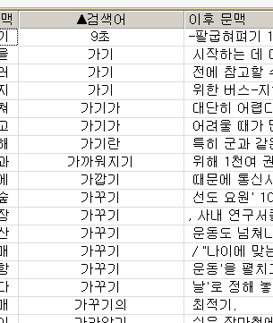

## 検索結果のソート

ここでは，検索プログラム한마루2.0（以下「한마루」とする）を用いて，21世紀世宗計画のコーパス検索結果を「정렬」（整列＝ソート）処理で並べ替える方法について紹介します．

## ソートの基本

何をおいても，検索結果が表示されていることが前提となります．コーパスを開いただけの状態では，「정렬」メニューがアクティブになっていません．

なお，ソートは検索結果全体に対して行われるのではなく，**新たに入力する検索式にヒットする例に対してのみ**行われます．

ソートに際して必要な情報は，検索式，演算（検索）範囲，**検索語の**ソート方式，文のソート方式です．

## ソートの実際

まず，検索結果を取得します．ここでも「演算」の場合と同じく，형태분석 말뭉치（形態素解析済みコーパス）のうち，`BTAA0001.txt`から連番の`BTAA0016.txt`を対象として検索を行います（26826文，361468文節，774828形態素）．
ここでは以下の検索（形態素検索）を行い，名詞形語尾の-기を含む文節を取得します．

```
#기/ETN#
```

語尾の-기だけで構成される文節はないので，前後に「`#`」（[0以上の独立した音節／品詞](tagged_corpus#0以上の独立した音節品詞)）をつけておきます．

上記の検索により，対象の16ファイルから2807文，3111個の例が検索されました．

### 簡単なソート

一番単純なのは，用例が示されているKWIC表示の見出し部分を右クリックして，「오름차순 정렬」（昇順にソート）もしくは「내림차순 정렬」（降順にソート）を選ぶことです．


上の図では「검색어」（検索語）を右クリックしたところですが，「이전 문맥」（前文脈）・「이후 문맥」（後文脈）もソート可能です．検索語の昇順ソート結果は以下の通り．



最初の例の表示が変ですが，検索結果に記号が含まれていると，表示がおかしくなります．

なお，「가꾸기」の用例を見ると分かるように，検索語だけを基準にソートしているので，後文脈などは無視されています．

### 「정렬」メニューの使用

今度は「정렬」（ソート）メニューを使ってみます．平文コーパス（원시 말뭉치）の場合は「어절 정렬」（文節ソート）が利用可能で，形態素解析済みコーパスと形態素・意味解析済みコーパスの場合は加えて「형태소(의미) 정렬」（形態素［意味］ソート）も利用可能です．

「文節ソート」の画面はこちら：


「形態素（意味）ソート」の画面はこちら：


二つの違いは品詞タグを入れるかどうかで，他は変わりません．

なお，上記で一番上のボックスに検索語を入力するのですが，この検索語が指定の範囲に現れる用例のみを対象に，ソートを行っていきます．最初に検索したときの検索語（`#기/ETN#`）と区別するために，ソートの対象を決定するための検索語を「検索語②」と呼ぶことにします．最初の検索語（`#기/ETN#`）は「検索語①」としましょう．

さて，ソートのためのウインドウは，上から順に，

- 検索語②の入力ボックス
- 演算の範囲：検索語②を検索する範囲（前文脈6文節～後文脈6文節まで）
- 字素検索用の入力ボックス
- （形態素［意味］ソートのみ）品詞タグ付与のボックス
- 検索語①のソート方式：検索語①をソートする方向．「순방향」（順方向）＝文節の頭からソート，「역방향」（逆方向）＝文節の後ろからソート
- 文のソート方式：用例の文をソートする方向．昇順もしくは降順

となっています．

検索語②には，[音節を表す演算子](raw_corpus#音節を表す演算子による検索)や[ブーリアン演算子](raw_corpus#ブーリアン演算子による検索)を用いることができます．

検索語①のソート方式は，文節のどちら側からソートを行うかということですが，文節の頭から揃えていきたいときは「順方向」で，語尾など文節の後側から揃えたいときは「逆方向」でソートすると良いでしょう．なお，**検索語①のソート自体は常に昇順**で行われるようです．

同じ検索語①の用例内では，前文脈の先頭から「文のソート方式」で指定された「昇順」もしくは「降順」でソートが行われます．

#### 文節ソートの例

まず，検索結果から「検索語①の前1文節以内に를もしくは을で終わる文節がある例」を対象に，検索語①を文節の先頭から昇順にソートしてみます．

音節を表す演算子，ブーリアン演算子を利用して，検索語②の入力ボックスには「`*를|*을`」と入力します．演算の範囲は前文脈に「1」，後文脈は「0」を入力もしくは空白とします．ソートの方式などはそのままにして，「추가▼」（追加）ボタンを押してください．以下の図のようになったでしょうか．


その上で「정렬」ボタンを押すと，演算の場合と同じく，検索語②に該当する例のみ背景色が変わり，ソートが行われます．以下はその一部．


検索語①の先頭から昇順でソートが行われていることが分かります．
また，多くは目的語を示す対格語尾がついた例ですが，例を見ていくと「큰 피해는 **없을** 것이기 때문이다.」のような連体形語尾の例も含まれています．

なお，図中で「강화하기」の一連の例を見ると，前文脈の先頭から昇順にソートされていることが分かります．これは「文のソート方式」で「昇順」を設定したためです．以下に抜粋してみます．

|  前文脈  |  検索語①  |  後文脈  |
|--------:|:--------:|:-------|
| **E**AEC는 우리 스스로 지역 경제의 이익을 | 강화하기 | 위해 만든 생산적 협의체이다. |
| **그**럼에도 불구하고 [...] 경제 협력을 | 강화하기 | 위한 '밀월 관계'에 있기 때문에 [...] |
| **보**사부는 지난 89년부터 [...] 약품 임상 시험 기준을 | 강화하기 | 위한 위원회의 활동도 [...] |
| **아**시아 6 개국은 현재 경제 협력 관계를 | 강화하기 | 위한 작업을 진행 중이지만, [...] |
| **이러**한 국제 질서 속에서 [...] 우리의 입지를 | 강화하기 | 위해서도 경제를 우선적으로 키워 나가야 하겠다. |
| **이번** 회의에서는 또 유엔의 인권 활동을 | 강화하기 | 위한 구체적인 행동 계획의 일환으로 [...] |
| **정** 장관은 이어 기업의 소비성 경비에 대한 규제를 | 강화하기 | 위해 접대비 등에 대한 손비 인정 한도를 축소하고 [...] |

「文のソート方式」で「降順」を設定すると，逆の順番にソートされます．

##### 検索語①を全てソートしたい場合

検索語②に「`*`」を入力すれば，全ての用例について，検索語①を基準にソートが行われます．「検索語①のソート方式」で「順方向」を指定すれば文節の頭から，「逆方向」を指定すれば文節の終わりからソートが行われます．

> 「演算の範囲」としてそれぞれに「0」を入力するか，どちらも空白にしておけば，対象を検索語①に絞ることができます．
> ただ，「`*`」を入力した場合，範囲はあまり関係ないようでした．

#### 形態素（意味）ソートの例

今度は，同じ検索結果を対象に，検索語①に過去の接尾辞を含む例を取り出し，文節の終わりからソートしてみます．

「形態素（意味）ソート」メニューを選び，検索語②には「`#았/EP#|#었/EP#`」と入力しましょう．こちらも，過去の接尾辞だけで構成される文節はないので，「`았/EP`」と「`었/EP`」のどちらにも，前後に「`#`」をつけておいてください．演算の範囲はどちらも「0」もしくは空白にしておき，「検索語①のソート方式」を「逆方向」にしておきます．以下の図を参照のこと．


これでソートを行うと，以下のようなソートが行われます．


最初の例はちょっと趣旨とはずれますが，それでも検索語①に過去の接尾辞が含まれていることにはなります．ほとんどの例で直後に「때문」が続いていることが分かります．
