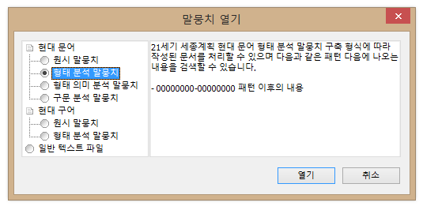

## 世宗コーパスの使い方

以下の文書では，検索プログラムである한마루2.0（以下「한마루」）を用いて，21世紀世宗計画のコーパスを検索する方法について説明します．検索の具体的な方法については，下部の[さまざまな検索](#さまざまな検索)以下の文書を参照してください．

### 前提

한마루の公式説明書として，プログラムと一緒に配布されている「한마루 2.0 사용자 설명서(2011 수정/보완)」（`한마루_2.0_사용자설명서.hwp`と`한마루_2.0_사용자설명서.pdf`）があります．以下の文書で参照する場合，「ガイド」として引用し，章番号とページ数を記載しておきます．例えば「ガイドp.15『4. 마. 검색 결과 저장』」のように表記します．

また，以下の文書では次のような表記を用います．検索語として入力する内容については，

```text
実際の検索語
```

のように表記しますので，同じように入力してください．提示した検索式によって検索される例については，以下のように示します．

* コーパスから，**実際の検索語**によって検索される文

例の中で，検索式に該当する（マッチする）部分については上記のように**太字**で示します．ここで提示する例は，全て21世紀世宗計画のコーパスから実際に検索されたものです．

また，検索式で用いられる特殊文字（演算子）などについては`特殊文字`のように表記します．

本文と関連する補足的な内容については，

> 本文の補足的な内容です．

のように記述することとします．

## 検索のための準備：導入

### 한마루のインストール

「21세기 세종계획 성과물 DVD」がある場合，プログラムをコンピュータにコピーすることで利用可能です．

> 한마루はWindowsでのみ実行可能です．古いバージョンの日本語Windowsなどでインターフェイスが文字化けする場合，ロケールを韓国語に設定することで回避できるかもしれません．日本語版のWindows 8以降では問題なく表示できます．

~~あるいは国立国語院の「[국립국어원 언어정보나눔터](https://ithub.korean.go.kr/user/corpus/programManager.do)」からプログラムをダウンロードすることができます．ただしアカウントの作成が必要です．~~

> 2022年現在，上記「국립국어원 언어정보나눔터」は利用できません．以下も同じです．

### コーパスのインストール

「21세기 세종계획 성과물 DVD」を利用します．それぞれのファイルをコンピュータにコピーする必要はありませんが，DVDから検索するより，コンピュータにコピーしたファイルを検索するほうが，より高速です．

~~コーパスのファイルは上記と同じく[국립국어원 언어정보나눔터](https://ithub.korean.go.kr/user/total/database/corpusManager.do)からダウンロードできます（アカウント作成が必要）．~~

## 検索のための準備：コーパスの読み込み

한마루を起動して，メニューの「파일」＞「열기」＞「말뭉치 열기」を選択します．



上記のダイアログが表示されたら，「현대 문어」（現代語・書きことば）もしくは「현대 구어」（現代語・話しことば）の「원시 말뭉치」（平文コーパス），「형태 분석 말뭉치」（形態素解析済みコーパス），「형태 의미 분석 말뭉치」（形態素・意味解析済みコーパス），「구문 분석 말뭉치」（構文解析済みコーパス）を選択し，「열기」ボタンを押します．ファイル選択のダイアログが表示されるので，目的のファイルをいくつでも選択し，「開く」ボタンを押します．ファイルのオープンと分析が終わると，検索が可能になります．

> ファイル選択の際，Ctrlキーを押しながら任意のファイルを複数選択することができます．

なお，上記のダイアログで選択したコーパスの種類と，実際に開くコーパスの種類は一致している必要があります．一致していない場合，結果が正しく表示されないことがあるようです（ガイドp.8「4. 나. 주의 사항2」）．

コーパスの種類と，可能な検索のタイプは以下のとおりです（ガイドp.21「5. 검색」）．

| &nbsp; | 文節検索 | 形態素検索 | 形態素・意味検索 | 構文検索|
|:-------|:------:|:--------:|:------------:|:-----:|
| 平文コーパス  | ○  |   |   | |
| 形態素解析済みコーパス  | ○  | ○  |   | |
| 形態素・意味解析済みコーパス  | ○  | ○  | ○  | |
| 構文解析済みコーパス  | ○  | ○  |   | ○ |

上記ダイアログで「일반 텍스트 파일」（一般テキストファイル）を選択すると，自分で作成したテキストファイルを検索対象とすることができます．その際，対象とするテキストファイルはUTF-16LE（**BOM付き**）でエンコーディングされている必要があります．また，コーパスの種類としては平文コーパスとして扱われます．

> 自分で作成したテキストファイルがEUC-KRもしくはUTF-8でエンコーディングされている場合，한마루の「변환」（変換）機能を用いてUTF-16LEエンコーディングに変換することができます（ガイドp.18「4. 사. 변환」）．

### 注意事項

한마루では，検索対象のコーパスを全てメモリに読み込みます．大量のファイルを読み込む場合は時間がかかるので注意してください．場合によってはメモリの不足で，全てのファイルを読み込めない場合があります．そのような場合には，他に実行しているプログラムがあればそれを終了し，再度ファイルを読み込んでみてください．

## さまざまな検索

* [文節の検索](raw_corpus)
  * [検索の基本](raw_corpus#検索の基本)
  * [音節を表す演算子による検索](raw_corpus#音節を表す演算子による検索)
  * [文節をまたいだ検索](raw_corpus#文節をまたいだ検索)
    * [ブーリアン演算子による検索](raw_corpus#ブーリアン演算子による検索)
  * [字素の検索](raw_corpus#字素の検索)
* [品詞タグを利用した形態素の検索](tagged_corpus)
* [検索結果の演算](corpus_calc)
* 検索結果のソート
* [検索結果を保存してExcelで利用する](save_data_to_excel)
