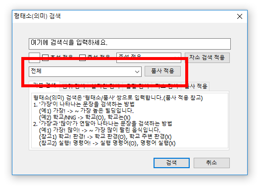

## 品詞タグを利用した形態素の検索

ここでは，検索プログラム한마루2.0（以下「한마루」とする）を用いて，21世紀世宗計画の形態素解析済みコーパス（형태분석 말뭉치）を検索する方法について紹介します．

## 検索の基本

まず，品詞タグを用いて検索する場合，**基本的に文節を単位とする検索のみ可能**であることに注意しましょう．ある1つの単語もしくは形態素を検索式に入力すると，文節内にその単語・形態素を含む場合しか検索されません．例えば，検索ボックスに

```text
고향/NNG
```

を入力して検索すると，

  * 흑수말갈의 **고향** 바다에 연해 있다고 하여
  * 나는 **고향** 집 앞마당에 있는 감나무와 살구나무를 떠올려보고

もしくは

  * 시는 모든 예술의 **고향**/홍신자 외 지음 문학사상사

といった，直後に記号が続く例のみ検索されます．

「고향이」など後ろに助詞が続く例や，場合によっては分かち書きがされていない「내고향」などは検索されません．

### 品詞タグの入力

上記では，品詞タグ（`/NNG`）まで直接検索ボックスに入力しましたが，品詞タグの記号が分からない場合，検索ダイアログのリストから選んで入力することができます．



上の検索ダイアログ画像で，赤枠で示した部分のリストから該当する項目を選び，隣の「품사 적용」（品詞適用）ボタンを押します．すると検索ボックスのカーソル位置に，スラッシュ（`/`）も含めた品詞タグが入力されます．

動詞や形容詞などの用言を検索する際には，語幹のみ入力して品詞タグを付ける，という点に注意してください．例えば動詞먹다「食べる」は，`먹다/VV`ではなく，`먹/VV`のように入力する必要があります．

> 複数の品詞タグを「品詞適用」ボタンで入力する場合，「품사를 연속으로 적용할 수 없습니다.…」（品詞を連続で適用することはできません）といった警告が表示されることがあります．いろいろ試してみたところ，スラッシュから4文字目以降でないと，品詞タグが適用できないようです．つまり，
> * `이/NP는`の末尾…適用不可，警告表示
> * `이/NNG는`の末尾…適用可能
> * `이/NP부터`の末尾…適用可能
> * `이/NNG부터`の末尾…適用可能<br>
>
> のように，品詞タグのアルファベットや形態素まで含めて，前のスラッシュから4文字目以降でないと，品詞タグをボタンで入力することはできません（あくまで仮説ですが）．ともかく，上記の「適用不可」のケースでは，検索ボックスに直接品詞タグを手入力する必要があります．

#### 品詞タグのリスト

検索時に用いることのできる品詞タグは以下の通りです．

| 品詞   |   記号   |  品詞  |  記号 |
|:-----:|:------:|:-------:|:------:|
| 일반명사 |  NNG  |  고유명사  |  NNP |
| 의존명사 |  NNB  |  대명사  |  NP |
| 수사 |  NR  |  동사  |  VV |
| 형용사 |  VA  |  보조용언  |  VX |
| 긍정지정사 |  VCP  |  부정지정사  |  VCN |
| 관형사 |  MM  |  일반부사  |  MAG |
| 접속부사 |  MAJ  |  감탄사  |  IC |
| 주격조사 |  JKS  |  보격조사  |  JKC |
| 관형격조사 |  JKG  |  목적격조사  |  JKO |
| 부사격조사 |  JKB  |  호격조사  |  JKV |
| 인용격조사 |  JKQ  |  보조사  |  JX |
| 접속조사 |  JC  |  선어말어미  |  EP |
| 종결어미 |  EF  |  연결어미  |  EC |
| 명사형전성어미 |  ETN  |  관형형전성어미  |  ETM |
| 체언접두사 |  XPN  |  명사파생접미사  |  XSN |
| 동사파생접미사 |  XSV  |  형용사파생접미사  |  XSA |
| 어근 |  XR  |  마침표,물음표,느낌표  |  SF |
| 쉼표,가운뎃점,콜론,빗금 |  SP  |  따옴표,괄호표,줄표  |  SS |
| 줄임표 |  SE  |  붙임표(물결,숨김,빠짐)  |  SO |
| 외국어 |  SL  |  한자  |  SH |
| 기타기호(논리수학기호,화폐기호) |  SW  |  명사추정범주  |  NF |
| 용언추정범주 |  NV  |  숫자  |  SN |
| 분석불능범주  |  NA  |  | |

## 演算子を用いた検索

### 「`#`」＝0以上の独立した音節／品詞

`#`は，「0以上の独立した音節／品詞」を表します．検索対象の前か後，または前後両方につけると，検索対象以外の要素がついている場合／ついていない場合の両方を検索してくれます．例えば，

```text
고향/NNG#
```

を検索すると，最初の検索例に加えて，

* 그들의 **고향은** 언제나 현재 머물러 있는 곳이다.
* 싸릿대 얽어 만든 울타리와 사립문도 모두 다 바뀌어 버린 낯선 **고향집**.

のように，「『고향/NNG』の後ろに何か続く文節」も検索されます．

また，前にも`#`をつけた

```text
##고향/NNG#
```

を検索すると，さらに

* \`한국의 맛', **\`고향의** 소리', **\`고향의** 맛'으로 이어지는 일련의 광고 캠페인이 탄생하게 된다.
* 차를 세우고 마셔본 우물물도 **옛고향의** 우물맛 그대로였다.

などの例が検索されます．

### 「`-`」＝1以上の独立した音節／品詞

`#`と似た要素に`-`がありますが，これは「1以上の独立した音節／品詞」を指すため，検索したい要素の前後に他の形態素を伴う例**だけ**が抽出されます．例えば

```text
-고향/NNG
```

を検索すると，

* 마음은 **제고향** 지니지 않고

のように，文節内で他の要素が前にある例だけが検索され，「고향」だけで成り立つ文節は除外されます．さらに

```text
-고향/NNG-
```

としてみると，

* 둘은 **한고향에서** 온 형제 같은 사이였습니다.
* 누가 **"고향이** 어데시오?"

などのように，記号も含め，文節内で前後に他の要素がある例だけが検索されます．

### 「`#`」と「`-`」の組み合わせ

また，`#`と`-`を組み合わせて，

```text
-고향/NNG#
```

とすれば，「文節内で普通名詞『고향』の前に他の要素が**必ずあり**，後ろには他の要素が**あってもなくてもよい**」という，以下のような例が検索されます．

* 파충류의 위협을 피하여 **옛고향인** 물 속으로 다시 들어가
* 대표곡 **'내고향** 마산항'을 새겨넣은 것이다.

### 「`!`」＝全ての品詞

上記の検索例では全て「고향*/NNG*」のように品詞を指定していましたが，代わりに`!`を用いることで，全ての品詞を含めることができます．例えば，

```text
제일!
```

のような検索を行うと，「제일」という語／形態素からなる文節を全て検索します．

### 注意すべき事項

なお，助詞や語尾だけで成り立つ文節，というものが全くないとは言い切れませんが，通常の場合，体言や用言などがたいていついているものです．そのため，語尾や助詞などの検索においては`#`や`-`を用いる必要があるでしょう．例えば接続形語尾の-고を検索する場合，`고/EC`のような検索式では検索結果が得られません．語尾の前に用言や接尾辞などがつくのは当然なので，`#고/EC`のように，語尾の前に`#`（または`-`）をつけてやる必要があります．


### 音節を表す演算子との組み合わせ

「文節の検索」の「[音節を表す演算子による検索](raw_corpus#音節を表す演算子による検索)」で説明した，`?`（1つの音節），`%`（0または1つの音節），`*`（0以上の音節），`+`（1つ以上の音節）を用いることもできます．

例えば

```text
???*/MM
```

というような検索では，最低3音節以上からなる冠形詞（MM），すなわち

* 빨간 힘줄이 도드라진 그 목은 한 손에 움켜잡을 수 있을 만큼, 그래서 조용히 눌러도 **아무런** 저항이 느껴지지 않을 것처럼 기진해 있다.
* 금순네가 돌개에서 쫓겨내려고 **별의별** 압력을 다 동원했읍니다.
* **그까짓** 거 애꼈다 뭐 하려고 안 팔아요."
* 컴퓨터상의 **이런저런** 형식적 실험을 통하여 문학의 다양성에 기여하고 나아가 문학의 지평을 확장시킬 수 있는 가능성도 보여주었다.

といった例が検索されます．

### 文節内での共起を検索する

複数の形態素を，スペースで区切らずに検索文字列として与えると，同じ文節内での共起例を検索することができます．上記の「音節を表す演算子」との組み合わせも可能です．

例として，

```text
-+/NNB+!+/JKB
```

という検索式は，「必ず他の形態素が前にあり，1音節以上の形式名詞（NNB），1音節以上の何らかの形態素一つ，1音節以上の副詞格助詞（JKB）が，この順序で現れる文節」を検索することになります．結果の一部は以下の通り．

* 특히 국제기관들의 '글로벌 가버넌스'의 적절성에 대해 **첫번째로** 꼽는 평가 기준은 `정통성'이라고 볼 수 있다. (＜첫/MM+번/NNB+째/XSN+로/JKB)
* 그러나 23부제도 불합리한 점이 많아 시행한 지 불과 1년 **2개월만에** 폐지되고 말았다. (＜2/SN+개월/NNB+만/NNB+에/JKB)
* 일부 용산 게임매장에서는 현금으로 **25만원선에서** 거래되고 있다. (＜25/SN+만/NR+원/NNB+선/NNG+에서/JKB)
* 지난 84년 방황하는 **십대들에게** 조언과 용기를 전하는 작은 메시지를 담아 시작했던 `십대들의 쪽지'가 지난 9월. (＜십/NR+대/NNB+들/XSN+에게/JKB)
\end{itemize}

## 字母を指定した検索

1つの音節内での字母を指定して，検索を行うことができます（ガイドp.25「5. 가. 어절 검색 5) 자소 검색식」）．1つの音節を`[  ]`でくくり，`[初声,中声,終声]`のように，字母をコンマで区切って指定します．`[  ]`内，コンマの前後にスペースが入らないようにしてください．ただし，「終声がない」例を検索する場合に限り，「終声」として` `（スペース）を記述することが可能です．

なお，字母の代わりに以下のような演算子を用いることができます．

| 演算子 | 意味・役割 | 使用可能な箇所  |
|:---:|:--------:|:------------:|
| ? | 何らかの字母が必ずあり，その字母は何でもよい | 初声・中声・終声 |
| % | 字母があってもなくてもよい | 終声のみ |

要するに，`?`は「1つの字母」を表し，`%`は「0または1つの終声字母」を表すということになります．なお，初声・中声・終声の全てに1つずつ字母を記述することはできません．少なくとも一つは，上記の演算子を含む必要があります．

形態素を示す演算子やタグとの併用もできます：

* `#[?,?,ㄴ]데/EC`：0以上の形態素に続く，終声ㄴで終わる音節に데が続く接続形語尾＝接続形語尾-ㄴ데がついた活用形
* `#[ㄹ,?,%]/EC`：0以上の形態素に続く，初声ㄹで始まる接続形語尾＝-라，-러，-려などの接続形語尾がついた活用形．「初声ㄹで始まる」語尾のみ検索するため，-으러や-으려といった異形態は含まれない

## ブーリアン演算子による検索

「文節の検索」の「[ブーリアン演算子による検索](raw_corpus#ブーリアン演算子による検索)」で説明した演算子，`&`（「AでありかつB」，AND）と`|`（「AまたはB」，OR）を用いることも可能です．

### 「`&`」＝AND「かつ」

`A&B`のように記述し，項目Aの後ろに項目Bが現れる例を検索します．例えば

```text
절대/MAG&안!#
```

という検索式は，「절대」という副詞（`MAG`）が現れた後に，品詞を指定しない「안」に0以上の形態素がついた文節が現れる例を検索します．

  * 점차 혼자 자는 날을 늘려 나가는데 도중에 아이가 울거나 불안해하더라도 부모는 **_절대_ 초조한 빛을 보여선 _안_** 된다.
  * 아무리 배고파도 자기 차례를 기다릴 것, 입안 가득 음식이 들었을 때는 **_절대_ 말하지 말 것, 좋아하는 것만 골라 먹거나 싫다고 _안_** 먹지 말 것, 다 먹고 나면 자기가 먹은 쟁반을 지정된 자리에 놓고 나갈 것 등등….
  * ▴ 알콜 중독자는 환자임을 명심하고 **_절대_ 감정적으로 대하지 말라 ▴ 술값 외상을 갚아 주거나 회사에 거짓 핑계로 결근을 알려 주는 일은 절대 피하라 (알콜 중독자의 책임을 대신하지 말라) ▴ 먹고, 자고, 일어나는 것 등 알콜 중독자의 생활을 챙겨주지 말라 ▴ 실수나 비행을 감싸지 말라 ▴ 섣불리 파경의 위기를 만들지 말되 자연스런 파경이라면 피하지 말라 ▴ 알콜 중독자에게 꼬박꼬박 반응해선 _안되지만_** 반대로 너무 무관심한 척해도 상황을 악화하기 쉽다 ▴ 상황이 심각하면 무조건 피하라.

「文節の検索」の「[ブーリアン演算子による検索](jakle:sejong:raw_corpus#ブーリアン演算子による検索)」で説明したように，直後に続く例だけでなく，複数の文節をまたいだ検索例が出る点に注意しましょう．

### 「`|`」＝OR「または」

`A|B`のように記述し，項目Aか項目Bが現れる例を検索します．助詞の異形態などを一括して検索する場合に有効です．例えば

```text
(#는/JX|#은/JX|#ㄴ/JX)
```

という検索式では，0以上の形態素に補助詞（`JX`）の-는または-은または縮約形-ㄴがついている文節を検索します．

* 하나 **우리는** 아직 축하의 폭죽을 터뜨리기에는 이른 것 같다.
* 내 **집은** 어디에."
* '공간의 시학'은 어떤 **의미에선** 바슐라르 상상력 이론 체계의 중요한 전환점을 가져온 저작이라 볼 수 있다.

### ブーリアン演算子の組み合わせ

`&`と`|`を組み合わせて用いることができます．その場合は，優先順位に応じて`()`でくくりますが，`()`でくくった部分が優先されます．

例えば

```text
(#는/ETM|#ㄴ/ETM|#은/ETM|#ㄹ/ETM|#을/ETM|#던/ETM)&때/NNG#
```

という検索式では，以下のような例が検索されます．

* 이렇게 **볼 때** 종교적 문제가 요인으로 작용했던 것은 2차 기포에 극히 한정됩니다.
* 시민 스스로가 공명하게 대표를 뽑아야 한다는 인식과 실천이 그 어느 때보다도 **중요한 때다**.
* 그것은 영하 14∼15도로 땅이 **얼던 때였다**.
* **_경사진_ 곳에 차를 세울 _때_** 주차 브레이크를 당겨놓고 기어를 넣어 둠은 물론, 바퀴에 버팀목을 받치는 등 2중, 3중의 안전 조치를 취해야 한다는 것쯤은 운전사로서 기초 의무에 속하는 일이다.
* 그 가운데 얼굴을 못 알아 **_볼_ 만큼, _때묻은_** 사람이 있었다.
* 이번 사고를 보면서 우리가 우선 지적하고 **_싶은_ 것은 항상 대형 사고를 겪을 _때마다_** '고질'로 꼽혀온 안전 관리 상의 허점이 전혀 개선되지 않았다는 점이다.
* **_지난_ 총선거 _때_** '국회 의원은 기독교인이, 대통령으로 장로가 되어야 한다'고 발언한 개신교 목사가 있었다는 것도 그 점을 깨닫게 한다.
* 24일 광고 **_대행사인_ (주)비티가 서울 시민 5백 명을 대상으로 실시한 '선물 행태 조사'에 따르면 조사 대상자의 84.7%가 명절 _때_** 선물을 받은 경험이 있다고 답변했으며, 선물로는 구두 티켓이 89.5%로 가장 많았다.

## 文節の範囲を指定した検索

「文節の検索」の「[文節の範囲を指定した検索](jakle:sejong:raw_corpus#文節の範囲を指定した検索)」で説明した`@`を用いることも可能です．

ある項目Aを基準として，その前後の範囲を文節数で指定し，指定した範囲内に項目Bが現れる，というような検索を行うことができます．範囲の指定には`@`を用い，`@`の前後に，検索の範囲として指定する文節数を数字で記述します．例えば，項目Aの前（＝左側）3文節以内か，後ろ（＝右側）2文節以内に項目Bが現れる，という検索を行う場合は，

```text
項目A 3@2 項目B
```

のような検索式を書きます．項目Aと範囲指定の式，項目Bの間には，それぞれスペースが必要です．範囲指定の数に0を指定すると，そちら側の範囲は除外されます．例えば`3@0`であれば，基準とする項目の前3文節だけが範囲として指定されます．0の代わりに数字を省略して，`3@`としても同じです．

## 検索式の例

### 目的格助詞（JKO）-를/을の右側3文節以内に動詞（VV）가다が来る例

```text
(#를/JKO|#을/JKO) @3 가/VV#
```

* 자동차 지붕 위에 자전거를 서너 대까지 장착하고 일가족이 **여행을 가곤** 한다.
* 지리산 자락의 대원사에서 **불경을 접하고 해인사로 가** 동산 스님에게 출가한 것이 24세때인 36년.
* 그 엄마는 자기 아이가 그날 익혀야 할 **것을 배워 가** 방과 후 반복해 가르치는 것이었다.
* 수도 부다페스트에서 헝가리 초원의 **기마쇼를 보기 위해 가는** 길도 끝 없는 초원의 연속이었다.

なお，この例では項目を入れ替えて

```text
가/VV# 3@ (#를/JKO|#을/JKO)
```

としても，同じ結果を得ることができます．

### ㄹで終わる連体形語尾（ETM）にスペース一つを空けて，依存名詞（NNB）만と0以上の形態素が来る例

```text
##[?,?,ㄹ]/ETM 만/NNB#
```

  * 미LPGA투어 소속 선수 중에서 나이키와 계약하는 '1호' 골퍼라는 점도 **주목할 만하다**.
  * 이럴 경우엔 유신의원을 사직하고 지역구 보선에 **출마할 만도** 했다.
  * '할인'이라고 **이름붙일 만한** 품목은 모조리 없애버린 것이다.
  * 그런 점에서 예산 편성 과정에서 벌써 정치성 사업을 포함시켰다는 사실은 **비판받을 만하다**.

この例から末尾の「`#`」を取ると，만の後ろにスペースが来る例だけが検索されます．

  * 충남 내륙-서해안-저수지 얕은 곳 **노려볼 만**
  * '디자인의 시대'라고도 불리는 21세기에 이 책은 문화 산업과 마케팅 등에 관심을 갖고있는 독자들에게 안내서로 적극 **추천할 만** 하다.
  * 그 활력은 과연 '삶의 예술'이라 **할 만** 하다.
