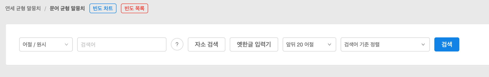
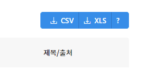
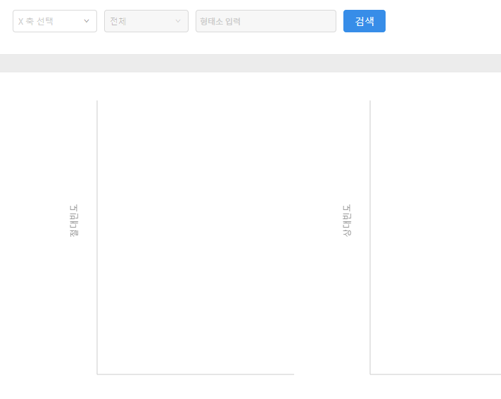
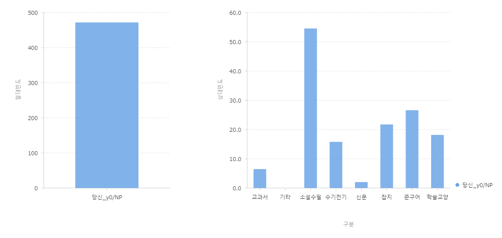
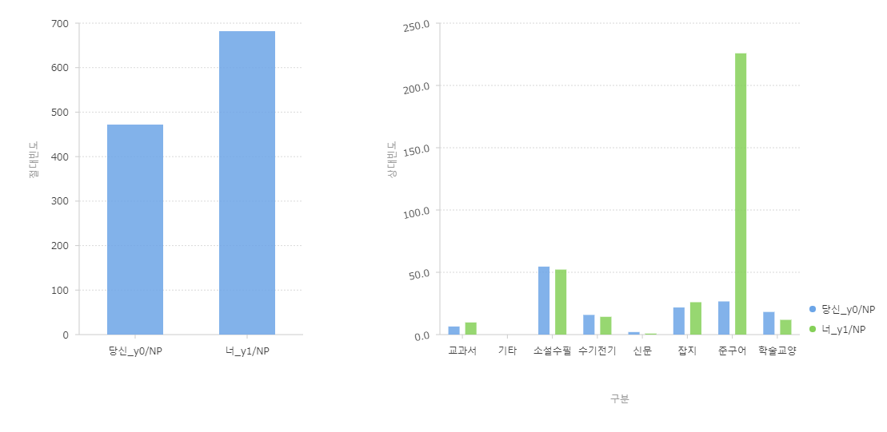

## 延世コーパスの使い方

### はじめに

ここでは，延世大学（연세대학교）言語情報研究院（언어정보연구원）が公開しているコーパスの利用方法についてまとめます．[ウェブで公開されているコーパス](https://ilis.yonsei.ac.kr/corpus/)を取り上げます．

検索結果の数や例を提示しますが，本文執筆時点での結果であることをお断りしておきます．

いくつかの文書に分けて説明していきます．

  - 概要（この文書）
  - 文語均衡コーパスの使い方
    - [文節の検索](written_1)
    - [連語の検索](written_2)
    - [文節内連接の検索](written_3)

## ウェブで利用できるコーパスの種類

このコンテンツの執筆時点で，以下のコーパスが利用可能です．

  - 연세 20세기 한국어 말뭉치（延世20世紀韓国語コーパス）
  - 연세 균형 말뭉치（延世均衡コーパス）
    - 연세 구어 말뭉치（延世口語コーパス）
    - 문어 균형 말뭉치（文語均衡コーパス）
    - 다의어 주석 말뭉치（多義語注釈コーパス）
  - 연세 교육용 말뭉치（延世教育用コーパス）
    - 광복 이후 초등 국어 교과서 말뭉치（光復以後　初等国語教科書コーパス）
    - \[6차,7차\] 초등 교과서 말뭉치（6次・7次教育課程　初等教科書コーパス）
    - 한국어 교재 말뭉치(전체)（韓国語教材コーパス（全体））
    - 한국어 교재 말뭉치(대화)（韓国語教材コーパス（対話））
    - 한국어 학습자 말뭉치（韓国語学習者コーパス）
  - 연세 주제별 말뭉치（延世テーマ別コーパス）
    - 한글 대장경 말뭉치（ハングル大蔵経コーパス）
    - 근대 유생가요 말뭉치（近代流行歌謡コーパス）
    - 독립신문 말뭉치（独立新聞コーパス）

いろいろありますが，とりあえずここでは[文語均衡コーパス](https://ilis.yonsei.ac.kr/corpus/#/search/WR)を例にして説明します．

## 基本的な操作

以下では，基本的な操作について説明します．検索の種類によらず，全体で共通する内容を見ていきます．

### 検索画面

初期画面は以下の通りです．

左から，

  - 検索の範囲・対象を選択するドロップダウンリスト（デフォルト：어절/원시）
  - 検索語を入力するボックス
  - ヘルプ表示（○で囲んだ「？」）
  - 「자소 검색」（字素検索）のトグルボタン（デフォルトはオフ＝背景白地）
  - 「옛한글 입력기」（古ハングル入力器）（カーソルを合わせると字母のボタンが表示される）
  - 検索結果表示の際，表示する前後文脈の長さを指定するドロップダウンリスト（デフォルトは前後20文節）
  - 検索結果のソート方法を指定するドロップダウンリスト（デフォルトは「検索語を基準にソート」）
  - 検索実行ボタン

となっています．検索の範囲・対象を変えると，表示されるフォームも若干変わります．

### 検索の範囲・対象

延世コーパスでは，検索の範囲と，検索の対象とするコーパスを選ぶことができます．文語均衡コーパスの場合，その組み合わせは以下の通りです．

| 範囲                 | 対象とするコーパス                    | 
| ------------------- |---------------------------------- | 
| 어절（文節）           | 원시（原文），형태의미（形態・意味）       | 
| 연어（連語）           | 원시（原文：2文節～4文節），형태의미（形態・意味：2文節～4文節） | 
| 어절 내 연접（文節内の連接） | 형태의미（形態・意味：全体，2形態素～4形態素）| 

上記の表のうち，検索の範囲は，以下の通りとなっています．

  - 어절（文節）：検索する対象を単独の文節内に限る
  - 연어（連語）：検索する対象を複数の文節に限る
  - 어절 내 연접（文節内の連接）：検索する対象を単独の文節内で，複数の形態素に限る

また，対象とするコーパスは以下の通りです．

  - 원시（原始）：品詞タグなどの注釈が付けられていない，原文テキストのコーパス
  - 형태의미（形態意味）：品詞タグ・意味分類タグの注釈が付けられた，形態・意味解析済みのコーパス

### 検索結果に表示する前後文脈の長さ

検索結果はKWIC（Key Word In Context）形式で表示されますが，検索語を中心語として，前後の文節数を10～50まで，5個刻みで設定することができます．前文脈と後文脈とで文節数を変えることはできません．

### 検索結果のソート

検索範囲「어절」と「어절 내 연접」でのみ表示されます．検索結果をソートする基準を設定します．以下の項目が利用可能です．

  1. 검색어 기준 정렬：検索語を基準としてソート
  1. 검색어 오른쪽 어절 기준 정렬：検索語の右側（後文脈）の文節を基準としてソート
  1. 검색어 왼쪽 어절 기준 정렬：検索語の左側（前文脈）の文節を基準としてソート
  1. 검색어 왼쪽 어절 기준 역순 정렬：検索語の左側（前文脈）の文節を基準として**逆順に**ソート

このうち，4番目について説明しておきます．これは文字通り前文脈の後からソートを行っていきます．「어절」を範囲として「원시」コーパスを対象に「때가」という文節を検索してみました．その際に，ソート基準を「검색어 왼쪽 어절 기준 역순 정렬」にしておくと，以下のような順序で結果が表示されます．ここでは前文脈の一部分と検索語のみ提示し，後文脈を省略します．

  - 겨울 **.** 때가
  - 춤을 추지 않더냐 **.** 때가
  - 지샐 것이니…**.** 때가
  - 스스로 관직에 나**갈** 때가
  - 무의식적으로 달려**갈** 때가
  - 배 부분이 반질반질하**게** 때가
  - 말기였던 77년 귀**국** 때가
  - 순수하던 **그** 때가
  - 인식 때문에 제품을 바**꿀** 때가
  - 회의를 느**낄** 때가
  - 새 예술이 나타**날** 때가
  - 책임지지 못할 말도 쏟아**낼** 때가
  - 중요한 용건을 꺼**낼** 때가
  - 술 안 먹고 잘 사**는** 때가
  - 겨울에 해당하**는** 때가
  - 반드시 오**는** 때가

上記は一部を抜き出していますが，見ての通り，前文脈の最後の文字から順番にソートされています．ただ，保存した結果などを利用して，前文脈の文字列を逆順にし，文字列単位でソートすると，ちょっと順番が違ったりします．もしかしたら字母単位でやっているのかもしれませんが，とりあえずこういうソートができますよ，という感じでよいのではないでしょうか．

残念ながら，以下で説明する検索結果の保存を行うと，生成されたファイルではこのソート結果が無視されているので注意．

### 検索結果の保存

検索を行って結果が表示されると，右上に「CSV」「XLS」というボタンが表示されます．

このボタンを押すと，（CSVとは書いてありますが）タブ区切り・UTF-8エンコーディングのテキストファイルか，Microsoft Excelのxls形式で検索結果を保存することができます．
一連番号を除き，検索結果に表示されているのと同じ内容（前文脈・検索語・後文脈・ジャンル・時期・出典名）が含まれます．テキストファイルは1行目から検索結果が入力されており，xlsファイルは1行目に見出し行が含まれています．また，xlsファイルは開くときに何か警告が出ますが，気にせず開きましょう．

また，ウェブブラウザで検索結果を見ていくと，途中でエラーが出て表示されないことがあります．そうした場合でも，どの形式であれファイルに保存すると，全ての検索結果が含まれています．

## 頻度情報の活用

検索とはちょっと話がずれますが，検索画面の上の方，「빈도 차트」という青いボタンと，「빈도 목록」という赤いボタンがあります．赤いボタンを押すと，形態素の頻度が一覧で示されたテキストファイルをダウンロードできます．

青いボタンを押すと画面が変わり，形態素を検索して，その頻度を表示することができるようになります．

左2つのドロップダウンリストで，「X축 선택（X軸選択）」は「구분（区分）」，2つ目は「전체（全体）」しか選べません．3つ目の「형태소 입력（形態素入力）」に検索したい形態素を入力します．ハングルで入力していくと，候補が提示されるので，目当てのものを選びましょう．例えば「당신」と入力して「당신_y0/NP」を選ぶと，以下のようなグラフが表示されます．

左の棒グラフはコーパス全体における絶対頻度を表し，右の棒グラフは「구분」＝コーパスのジャンル別の相対頻度を表します．グラフの棒にカーソルを重ねると，その数値が表示されます．

検索する形態素を複数入力することもできます．先の「당신_y0/NP」に「너_y1/NP」を加えて検索した結果は以下の通りです．

絶対頻度では「너」が多く使われていますが，コーパスのジャンル別に相対頻度を見ると，ジャンルによってバラツキのあることが分かります．

ここでは簡単な例を示しましたが，頻度情報を簡単に可視化できるのは便利そうです．

## 終わりに

연세 말뭉치（延世コーパス）の基本的な操作については以上です．以下，文語均衡コーパスの使い方は，[文節の検索](written_1)などの文書を参照してください．

内容に誤りや不正確な部分があれば，ご教示お願いいたします．
