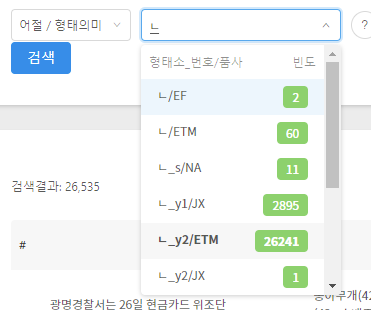
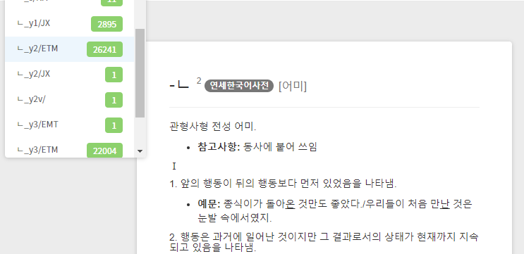

## 文節の検索

ここでは，延世大学（연세대학교）言語情報研究院（언어정보연구원）が公開しているコーパス（연세 말뭉치）のうち，[문어 균형 말뭉치（文語均衡コーパス）](https://ilis.yonsei.ac.kr/corpus/#/search/WR)の使い方，特に「어절（文節）」の検索についてまとめます．

検索結果の数や例を提示しますが，本文執筆時点での結果であることをお断りしておきます．

延世コーパスの概要については[연세 말뭉치（延世コーパス）の使い方](overview_yonsei)を参照のこと．

なお，ここで扱う文語均衡コーパスは，[ホームページ](https://ilis.yonsei.ac.kr/%ec%bd%98%ed%85%90%ec%b8%a0/%ec%97%b0%ec%84%b8%eb%a7%90%eb%ad%89%ec%b9%98/)の記述によると

> 다양한 장르의 텍스트를 포함하여 구축한 문어 말뭉치
> （多様なジャンルのテキストを含めて構築した書きことばコーパス

とされており，規模は1,054,362文節，とされています．100万文節のジャンル別内訳については表示がありません．

## 検索に先立って

ここでの「어절」（「文節」と訳しています）は，**入力データの上で**，半角スペースで区切られた単位を指します．「文節の検索」では，この「文節」の単位を超えた検索はできません．

> 文節を超えた検索を行いたい場合は，別の文書「[連語の検索](written_2)」を参照してください．

「入力データの上で」としましたが，データの上でスペースが入っていないと，1つの文節とみなされてしまう，ということになります．正書法の上で分かち書きをすべきところでも，データの上で（あるいはデータ入力の元となる原文で）分かち書きされていないと，1つの文節という扱いになります．

よく見られるのが，形式名詞などを前の文節につけてしまう，というようなケースです．

  - 하더라도 크게 걱정할 건 없을 듯 했다. 그런 가운데서 밝게 **웃을수** 있다는 건 좋은 환경에서의 웃음보다 더 건강한 삶을 살고 있다는
  - 생활을 하는 과정에서 1년 정도는 자신이 하고싶은 일에 투입하는 여유를 **가질수** 있도록 배려하는 것도 괜찮은 대안이리라 생각된다 . 그렇지 않을 경우
  - 나는 그 집이 일년 열 두달 형광등이 켜지지 않는 이유를 **알수** 있었다. 나는 그때 무심코 그 분의 검은 안경 너머에 서려있는

こうしたデータ上の誤り（？）があるかもしれない，ということは覚えておきましょう．

## 원시（原文コーパス）の検索

まず，メインの画面を見てみましょう．

一番左の「어절/원시」となっている部分で，検索の範囲・対象を選びます．デフォルトは「어절/원시」なので，原文コーパスはこのままで利用できます．
左から2つ目のボックス「검색어」となっている部分に，

```text
학교
```

と入力して，一番右の「검색」ボタンを押してみましょう．そうすると，「학교」だけで構成される文節を含む例が検索されます．「학교」だけで構成されている文節なので，「학교**에**」「학교**가**」「**초등**학교」などといった文節は検索されません．あくまで文節を単位として検索する，という点に注意してください．

また，文節内に記号が含まれている場合は，検索語にその記号を含めない限り，検索されません．例えば検索語を「그리고」とした場合，「**"**그리고」や「그리고**,**」と入力されている文節は検索にマッチしません．記号を含む文節まで検索したい場合は，以下で説明する「正規表現」の使用を検討してください．

### 正規表現の活用

検索語を入力するボックスの右側に○で囲まれた「？」ボタンがあり，これを押すと検索の例や，使用できる正規表現を見ることができます．原文コーパスで使える正規表現は以下の通りです．

  - `*`：長さが0またはそれ以上の文字（0以上の文字．文字があってもなくてもよい）
  - `?`：長さが1の文字（何らかの文字が必ず1つある）
  - `|`：「～または～」という意味のOR条件

#### 長さが0またはそれ以上の文字

`*`と`?`の使い分けを例で見てみましょう．

検索例：살＋0以上の文字(`*`)＋고

```text
살*고
```

結果（一部）：

  - 안받아 ◆Q. 올 초에 결혼한 만 29세인 홍길동입니다. 현재 전세를 **살고** 있는데 아파트 (시세 약1억9000만원)를 사려고 합니다. 직장을 다닌 지 2년이
  - 있다고 생각했는지도 모르겠다. 어머니는 예리를 통해 자신이 꿈꾸었던 인생을 다시 **살려고** 노력했고, 예리를 동창모임이다 계모임이다 자신의 친구들에게 데려가는 것을 좋아했으며, 모든
  - 다시 일어서 모래판에 설 수 있기를 기도할 뿐"이라며 애써 의지를 **살리고** 있다. "95 부산 민속 씨름 대회" 명칭 확정 한국 민속씨름
  - 말아주십시오", "아씨께서 양해해 주시기를 바랍니다"와 같은 말을 통해 상대방의 체면을 **살려주고** 있다. 8. 문장유형들의 화용론적 분석 각 문장들의 의미는 일차적으로 글자
  - 공간이다. 그 공간은 언제나 되돌아가고 싶은 공간이며, 그 곳에서는 삶이 **살만하다고** 느껴지는 공간이다. 지금 돌이켜 생각해 보면, 어린애였을 때의 나의 삶은
  - . 하지만 어쩔 것인가 ? 이미 많은 세월을 나는 보갈로서 **살아왔었고** 앞으로도 살아갈 수밖에 없는 것을 . 그랬다 . 누구에게도 들키지
  - 성전건립'을 위한 기도문이다. 만사를 주관하시는 주님, # 여기, 실향민 어우러져 **살았고** # 동해바다 명태 오징어 잡으며 살아온 # 덕장 즐비했던 모래땅
  - 칡냉면이 아니라는 점이 마음에 걸렸지만 아내는 아내대로 무언가 이쪽의 눈치를 **살피고** 있음에 틀림없었다. 그것이 더욱 마음을 저리게 했다. 마음과 달리 텔레비전의
  - 정설이다. 의학서 등 실용서적은 남겼고 진나라 정권에 반대한 일부 학자들을 **살해하였다고** 한다. 마지막으로 도로와 운하를 만들고 만리장성을 축조하여 기본적인 인프라를 갖추었다.

「長さが0以上」なので，살と고の間に文字があってもなくてもよいことになり，また文字がある場合も長さの制限はありません．単独の文節内で条件に合致する限り，どんな長さでも該当します．

#### 長さ1の文字

検索例：살＋長さ1の文字(`?`)＋고

```text
살?고
```

結果（一部）：

  - 면허증 주시죠 . ( 교통을 보고 비굴하게 웃는다 ) 아 , 이거 죄송하게 됐습니다 . 한 번만 봐주세요 . 먹고 **살라고** 바쁘게 뛰다보니 이렇게 됐네요 . 아무리 바빠도 신호는 지키셔야지 . 면허증 주세요 . 한 번만 봐주세요 . 서로 아는 처지에
  - 살 먹은 소년 발레르카는 옛 소련 지식인의 유배지이자 일본군 죄수와 포로들이 사는 강제노동막사에서 엄마와 단둘이 살고 있다. 엄마 니나는 먹고 **살려고** 매춘을 하지만 아직 아이인 발레르카는 그 와중에도 썰매를 사기 위해 돈을 모은다. 그러나 시장에서 차를 팔아 모은 돈으로 힘들게 산
  - 노벨상 수상의 본래의'빛'을 찾기는 쉽지 않을 것이다. 그럼에도 김 대통령은 국민 사이에 '기대의 싹'이 트도록 부단히 노력해야 한다. 그 기대를 **살리고** 부응하는 행동을 해야 한다. 김 대통령에게는 아직 임기 종료 휘슬이 불지 않았다. 이탈리아에 패색이 완연했던 한국 팀은 후반전 끝나기 직전에
  - 정리가 어느 정도 끝나고 집안이 안정되자 할아버지와 할머니는 개성으로 돌아갔다 . 어머니는 쿠바에서 부친 이삿짐을 찾느라고 몇 주일을 평양역에 나가 **살았고** 거주 수속을 하기 위해 이리 뛰고 저리 뛰어 다녔다 . 나는 또 애보기 담당이었다 . 어머니는 아이들만 남겨 놓고 나갈
  - 상견례를 드렸잖소 . 일취월장 연애하는 기분으로 서로의 빈 구석을 무엇인가 , 애정이라는 그 묘한 역학으로 채움으로써 온전케 되는 비밀을 터득하며 **살자고** 옆구리 쿡쿡 찌르지 않았었소 . 그렇지만 ' 촌닭 ' . 나는 당신으로부터 그리고 이 사회적 분위기로부터 자꾸만 외톨박이가 되어가고 있다는
  - 싶어서였다. 화장실 안 세면대 위에는 잡지 크기만한 조그만 거울 하나만 달랑 달려 있었다. 고씨는 그 거울에 얼굴을 들이밀고 왼쪽 모습도 **살피고** 오른쪽 모습도 살핀 연후에 눈썹도 다시 고르게 손질했다. 그리고는 남방셔츠의 깃을 바로잡고 하늘색 봄잠바의 칼라도 약간 세우는 듯 마는 듯

今度は，「長さが1の文字」なので살と고の間に**必ず何らかの1文字がある**，という文節が検索されます．

#### 正規表現の組み合わせ

次に，正規表現を組み合わせてみましょう．

検索例：살＋長さ1の文字(`?`)＋고＋0以上の文字(`*`)

```text
살?고*
```

結果（一部）：

  - 살려준다. 한편 주지 스님은 단호하게 거절하지 않으면 안 되는 자기의 입장을 이해시키기 위해 "제가 여간 난처하지 않습니다"라고 말함으로써 자신의 체면을 **살리고,** 또한 "제가 누구보다도 아씨의 마음을 잘 압니다", "노엽게 생각지 말아주십시오", "아씨께서 양해해 주시기를 바랍니다"와 같은 말을 통해 상대방의 체면을 살려주고
  - 짐승이라는 말이 마음을 불편하게 했던 게 아닌가 싶다. 여자는 예상하지 못한 일격에 움찔 놀란 듯 잠깐 동안 곁눈질로 내 눈치를 **살피고는,** 그러나 그 정도로 기가 눌리지 않는다는 걸 시위라도 하려는 듯 퉁명스럽게 반문했다. "화장은 왜 지우라고 그래요?" 나는 자꾸만 말을 하게

先ほどの「`살?고`」の例に加え，上記のように「고」以降に文字や記号が含まれる文節が検索されました．
「`살*고*`」のようにすると，「살펴보고자」「살고싶어'」のような例もマッチします．

なお，「`*고*`」や「`?고*`」のように，正規表現を検索語の両端に使うことはできません．検索しようとすると，警告メッセージが出ます．

#### 正規表現文字列のエスケープ

正規表現で使う文字列「`*`」と「`?`」を検索したい場合は，「`\`」（バックスラッシュ）を使ってエスケープします．

検索例：「`*`」という文字＋0以上の文字(`*`)

```text
\**
```

結果（一部）：

  - 규명되지 않은데다 남한 어민이 먼저 어업통제선을 넘었다는 증언까지 나오고 있는데도 일부 언론은 군당국과 정부의 소극적 대응을 비난하고 있다. 오늘의 프로 **\*** 희귀병 앓는 가족의 비애 아주 특별한 아침(M 아침 8시)=아버지가 아들을 살해한 사건이 충격을 주고 있다. 희귀병을 앓아온 아들은 가족의 짐이
  - "3당야합을 즉각 중단하라"는 등의 구호를 외친 뒤 화염병 5 개를 던져 2층당사 유리창 5장을 깨고 달아났다. 검찰, 신보사건 오늘 발표 **\*"박** 전장관 압력전화설 이운영씨 자작극" 결론 신용보증기금 대출보증 외압 의혹 사건을 수사 중인 서울지검 특수_y1부 (부장 이승구)는 9일 이운영 전 영동지점장이
  - 검사 남발 등 과잉진료로 이어질 수 있고, 전문적인 운영과 관리가 허술해져 장비의 효율이 떨어진다"고 말했다. /김철중의학전문기자 돌아온 물고기들 "한강도 물좋네" **\*서울** 45종… 지난해보다 9종 늘어; 서식환경 개선 "1급수 어종 아직…" 한강에 물고기가 돌아오고 있다. 버들매치, 새코미꾸리, 학꽁치, 꺽지, 황복, 가숭어가 수십년

ただし，手元の環境（Windows・日本語）では「`\?`」を認識（？）できず，「`갑니까\?`」とすると検索結果なし，となってしまいました．

#### OR条件の検索

正規表現と言ってよいか分かりませんが，検索語に「`|`」を用いて，「OR（または）」の条件による検索を行うことができます．

検索例：대학교または（`|`）대학생

```text
대학교|대학생
```

結果（一部）：

  - 대통령의 뉴딜정책을 연상케 했다. 해안선과 내륙을 달리는 1,600개의 고속도로가 건설됐고 **대학교** 11개가 세워졌으며 30억달러를 투자, 저수지와 도수로 등 760개를 연결한 캘리포니아
  - 부산시 서구 서대신동 2가 336 민주당 김영삼 총재 지역구 사무실에 **대학생** 40여명이 화염병 5개와 돌을 던지고 유인물 50여장을 뿌린 뒤 달아났다.

上記のように，「대학교」または「대학생」という文節が検索されます．「대학교**에서**」など，文節内に他の文字列がある場合は検索に該当しません．

正規表現式とOR条件とを組み合わせることも可能です．

検索例：0以上の文字(`*`)＋죠または（`|`）0以上の文字(`*`)＋지요

```text
*죠|*지요
```

結果（一部）：

  - 내 세계로 침잠하고 싶어, 알아 듣겠니?" 미소 띈 윤희의 말에 **"알아들어야지요** 뭐." 미혜가 빙긋 웃었다. "이런 말도 있지." 윤희가 덧붙였다. "결혼해서
  - . 두 분이니까 천원이죠 . 하루 세끼 드시면 9백원 한끼에 **3백원이죠** . 그리고 거기에 … 이를테면 선생님이 드시는 맥주같은 이런 건
  - … . 언제 송추를 떠나지요 ? 아마 저 강물이 줄면 **가겠지요** . ( 윤숙이 봉구의 얼굴을 유심히 본다 ) 네 네
  - 땐 늘 이 동전을 던져요 . 그리고 나머지 선택은 잊어버리는 **거죠** . 우리 , 이 동전에다 - 환유를 바라보는 정인의 표정
  - 재임용에서 탈락이 ! 네 ? 어쩜 그럴 수가 _ 이유가 **뭐죠** ? 할 말을 하셨다는 잘못 때문일 테지 _ 교내 문제에

上記のように，「죠」もしくは「지요」の例が検索されていますが，仮に終止形語尾の「-지요」とその縮約形である「-죠」を検索しようとしているのであれば，上記は少し問題があります．検索語として「죠（もしくは（지요）で終わる文節」を記述しているので，実際には文節内に「.」（ピリオド）や「?」（疑問符）を含んでいる例が検索結果に含まれていません．
一部のテキストは，なぜかピリオドやコンマなどの記号の前にスペースが1つ入っていて，別の文節として検索が行われているようです．それで上記の結果が出てくるわけですが，これでは記号が同じ文節内に記述されている例が除外されてしまいます．
これを防ぐため，前後に「`*`」や「`?`」を入れたいところですが，先に書いたように，検索語の両端に正規表現を使うことはできないため，この検索では無理と言えそうです．
文法項目を検索したい場合には，形態・意味コーパスを利用するのがよいでしょう．

### 「字素検索」の活用

さらに右側に「자소 검색」（字素検索）と書かれたボタンがあり，デフォルトではオフ（背景が白地）となっています．これを押すと，字素検索がオン（背景が灰色）となります．字素検索をオンにすると，一部の字母を特定して検索を行うことができます．

> 字素検索は，ここで説明する「어절（文節）の検索」と，後述する「연어（連語）の検索」の**原文コーパスでのみ**利用可能です．

字素検索オンの際は，上記の正規表現との組み合わせが必須です．また「`?`」の扱いが「長さが1の**文字**」ではなく，「長さが1の**字母**」という扱いになります．

検索例：나＋不特定の初声(`?`)＋不特定の中声(`?`)＋ㄹ지

```text
나??ㄹ지
```

結果（以下の2例のみ）：

  - 않는다는 생각이 들었습니다. 그쪽에 사시는 분들은 이런 말을 들으면 기분이 **나쁠지** 모르겠지만, 뭐 별다른 감정이 있어서 그러는 것은 아닙니다. 영화나 드라마
  - 드리는 … . 도착 즉시 전해 주세요 . 그럼 9월호에 **나올지** 모릅니다 . 그렇게 해 보죠 여기 오래 계실 겁니까 ?

「～ㄹ지」で終わる文節なので，「～ㄹ지**도**」など，さらに文字が続く文節は検索されません．後ろに続く場合も含めたい場合は，正規表現「`*`」も使います．

検索例：나＋不特定の初声(`?`)＋不特定の中声(`?`)＋ㄹ지＋0以上の字母(`*`)

```text
나??ㄹ지*
```

結果（上記2例に以下の例が追加）：

  - 겨냥이 잘못 되었다가는 튕겨나가 편의점 유리창을 깨뜨리거나 길바닥에 떨어져 깨져 **나갈지도** 모른다. 사람들이 놀라 그를 돌아볼 것이다. 그런 짓 자체가, 영업방해나

単に「～ㄹ지」で終わる文節を検索する場合は，正規表現「`*`」を使います．

検索例：0以上の字母(`*`)＋ㄹ지

```text
*ㄹ지
```

結果（一部）：

  - 세계사 교과서는 새로 써져야겠죠. 제 후배들이 배울 교과서의 내용이 어떻게 **달라질지** 궁금합니다. 전쟁을 원하시나요 어느덧 에브라힘의 일방적인 말에 대한 저항감이 점점
  - 그렇게 할 수 있는 것도 능력(?)이라는 말에 나는 아무런 이의도 **달지** 않고 인정해 주고 있다. 위장 오더, 지금 프로 리그에 습관적으로
  - 이달말로 예정된 4차 미-북협상에서 드러날 전망이다. 현재로선 그것이 어떤 것이 **될지** 알 수 없지만 지금까지의 협상태도를 보면 미국측이 명목을 어떻게 붙이든
  - 또는 사각형 모양으로 각 역의 특징을 담고 있다. 노량진역은 철도 **시발지** 기념비, 영등포역은 국회의사당, 대전역은 엑스포 꿈돌이, 정동진역은 소나무와 해돋이 광경

こちらも，「`*ㄹ지*`」のように「`*`」を検索語の両端に使うことはできませんが，中間に使うことは可能です．

検索例：만＋0以上の字母(`*`)＋ㄴ지＋0以上の字母(`*`)

```text
만*ㄴ지*
```

結果（一部）：

  - 퇴근하면서 데스크는 못박았다. "어쨌든 내일은 마감해야 하니까 오늘밤에 취재원을 다시 **만나든지** 전화로 취재를 하든지 해서 내일 아침 내 책상에 기사 올려놓으라구."
  - . 시청 앞 지하도 입구에서 헤어지면서 " 그럼 언제 다시 **만날는지** 기약이 없네요 . 안녕히 가세요 . " 나는 늘 그랬듯이
  - 싶어요. 그저 낯이 좀 익다 싶을 뿐… 어떤 자리에서 어떻게 **만났는지,** 그건 기억해낼 수 있을 것 같지 않네요?" "'무과화'는 기억할 테지."
  - 처마 곡선은 지붕을 마치 공중에 떠서 날갯짓하고 있는 새처럼 보이게 **만든다"라든지** "부석사 무량수전을 정면을 거의 돌아서 측면으로 접어드는 지점에서 바라보면 처마는
  - 트웨인이 나를 주인공으로 출연시키지 않고 톰을 주인공으로 시켜 톰만 부자를 **만드는지,** 이때는 지은이 마크 트웨인이 원망스러웠다. 그리고 나는 톰의 친구 하크가
  - 것으로 전해졌다. 현대정공의 경우에는 특히 탱크에 사용되는 철판 두께가 규정대로 **만들어졌는지와** 불필요한 부가 장비를 도입했는지의 여부, 국회 등에서 논란을 불러 일으켰던
  - 가정의학과 유태우 교수는 {밀폐건물증후군의 증상은 일시적인 것이 특징이지만 장기화될 경우 **만성기관지염이나** 폐기능 저하 등 만성 폐질환으로 진행되기 때문에 특히 주의가 필요하다}고

「`|`」を用いたOR検索も可能です．

検索例：0以上の字母(`*`)＋ㄴ지または(`|`)0以上の字母(`*`)＋ㄹ지

```text
*ㄴ지|*ㄹ지
```

結果（一部）：

  - 말씀이지요?" "예. 기침이 자주 나고 재채기도 많이 해요." "언제부터 그랬죠?" **"언제부터인지** 모르게 조금씩……" "살갗이 헐면 잘 아무는 편입니까?" "잘 안 아물어요.
  - 예상보다 강력함을 확인하게 될 것"이라고 덧붙였다. 유엔 안보리는 23일 밤 **(현지** 시각) 다국적군의 전면 지상전 개시 소식이 전해진 가운데, 당분간 안보리는
  - 나뉘어 있는 신성 여중과 신성 여고의 부지를 매각하고 제주시 영평동 **237번지** 일대 1만5천평 부지 위에 연건평 4천 6백 평에 달하는 통합된
  - 일이다. -(아이를) 입원은 시켜야겠는데, 며칠전에 벌여놓은 일의 마무리는 어떡해야 되는 **건지** 아이 곁으로 돌아오는 발길은 천근이다. 아이를 응급실에 둔 상황에서는 아무래도
  - 수소문해 봐서 적당한 임자만 나서면 곧바로 내보낼 작정이니까 너무 심하게는 **굴지** 말아 주구려." 그만큼 안존한 말로 다둑거려 놓았는데, 그래도 그가 없는
  - 도대체 몇 년인가 ? 사내 놈들에 넋이 나가 엉덩이를 흔들며 **굴러다닌지** 벌써 몇 년째인가 ? 나는 왜 사내들의 건장한 팔뚝이나 넓은
  - 강구하고 있다"며 "MRI 도입 자율화가 국민 건강수준 향상에 어느 정도 **기여할지** 의문"이라고 말했다. 현재 국내에는 245대의 MRI 장비가 운용되고 있고 금년

> なお，字母「ㄴ」で終わる文節をしたい，ということで「`*ㄴ`」のように検索語を指定すると，「자소만으로는 검색할 수 없습니다.」としてエラーになります．ただし，「`ㄱ*ㄴ`」のように字母を2つ以上記述する場合は問題ありません．検索語として字母を1つだけ指定することは無理，ということになります．

## 형태의미（形態・意味コーパス）の検索

形態素解析と意味解析がなされ，その注釈がつけられたコーパスの検索が可能です．語尾や助詞などの文法項目や，同音異義語がある単語を区別して検索する場合に便利です．

検索の画面で一番左のドロップダウンリストから，「어절/형태의미」を選びます．次に，その隣のボックスに検索語を入力しますが，ハングルで入力を始めると，逐次候補が表示されます．



上の図は，ハングルで「ㄴ」を入力したところです．複数の候補が，頻度とともに提示されます．韓国語の項目に続けて，「/」（スラッシュ）の後ろにアルファベットで品詞タグが表示されます．上記の例では，「EF」は終結語尾，「ETM」は冠形詞形語尾，「JX」は補助詞を指します．項目の直後にある「_」（アンダースコア）は，意味や用法別の枝番号を示しています．枝番号に「y」とあるのは，「연세한국어사전」（延世韓国語辞典）への参照です．カーソルを合わせると，以下のように辞書の対応する項目が表示されます．



ちょっと気をつけないといけないのが，品詞・意味のタグ付け内容がまちまちかもしれない，ということです．すぐ上の図で，「y2」が2つあるだけでなく，「y2v」などというものもあります．図に示したように，「-ㄴ<sup>2</sup>」は動詞につく連体形語尾です．ところが同じ「y2」の項目でも，品詞タグに「JX」と記述されたものもあります．
また，候補として「ㄴ_y3/**EMT**」と「ㄴ_y3/**ETM**」とがありますが，前者はどうも「ETM」の誤りのようです．しかも，前者を選択してみると動詞の過去連体形で，形容詞の現在連体形語尾を指す「y3」に該当しません．いずれも例が1つずつなので，大きく問題にならないかもしれませんが，検索の際には注意してください．

なお，原文コーパスとは異なり，OR条件（`|`）も含む正規表現が使えません．異形態などを検索する場合は，複数回検索を行う必要があります．上記のタグ付け内容と関連して，方言などもまとめられていることがあり，注意が必要です．[^ji]

## 終わりに

文節の検索については以上です．次は[「연어（連語）」の検索](written_2)をどうぞ．

内容に誤りや不正確な部分があれば，ご教示お願いいたします．

[^ji]: 例えば終止形語尾の「-지요」（`지요_y0/EF1`）を検索すると，「그렇지유.」「모르지유」のような文節も検索されます．
