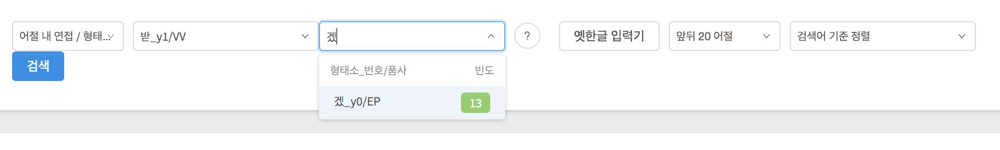

## 文節内連接の検索

ここでは，延世大学（연세대학교）言語情報研究院（언어정보연구원）が公開しているコーパス（연세 말뭉치）のうち，[문어 균형 말뭉치（文語均衡コーパス）](https://ilis.yonsei.ac.kr/corpus/#/search/WR)の使い方，特に「어절 내 연접（文節内連接）」の検索についてまとめます．

検索結果の数や例を提示しますが，本文執筆時点での結果であることをお断りしておきます．

延世コーパスの概要については[연세 말뭉치（延世コーパス）の使い方](overview_yonsei)を参照のこと．以下の記述では，「[文節の検索](written_1)」および「[連語の検索](written_2)」の内容を既に読んでいることを前提とします．

어절 내 연접（文節内連接）の検索では，**単独の文節内において**，その文節内で共起する2形態素の検索を行います．[正規表現](written_1#正規表現の活用)と[字素検索](written_1#字素検索の活用)のいずれも利用できません．また，対象コーパスは형태의미（形態・意味）だけです．

## 検索に先立って

こちらも[連語の検索](written_2)と同じく，常に2つの検索語を必要とします．1つ目の検索語を1番目の形態素として，そこからn番目の形態素を2つ目の検索語とし，それらの組み合わせだけを検索します（nは2～4）．ただし連語の場合と異なり，「전체（全体）」を選択することができます．こちらは，ある文節内で2つの形態素が位置に関係なく共起する例を検索します．

> 「位置に関係なく」と書きましたが，前後の順序は問題となります．例えば接尾辞「시_y7/EP」と「겠_y0/EP」とが共起する例を検索する場合，この順序で検索語を入力すると結果が出てきますが，逆にすると結果なし，となります．

検索画面で一番左のドロップダウンリストから「어절 내 연접」「형태의미」を選ぶと，さらに「전체」，「2형태소」から「4형태소」のいずれかを指定するよう，表示されます．この指定と，検索する対象の位置との対応は以下のようになります．

|  文節指定  |   1番目   |   2番目  |   3番目   |   4番目   |   5番目以降   |
|:-------:|:-------:|:---------:|:-------:|:-------:|:-------:|
|   | 받 | 으시 | 었 | 겠 | 지요 ... |
| 2형태소     | 検索語1     | 検索語2|    |    |    |
| 3형태소     | 検索語1    |           |検索語2 |     |   |
| 4형태소     | 検索語1    |           |   | 検索語2    |   |
| 전체     | 検索語1    | <- 検索語2（ここのどれか）- | --- | --- | --> |

検索していくと，「検索された用例数が多すぎる」といったエラーの出ることがありますが，保存用のボタンが表示されていれば，それを使って検索結果を保存できる場合があります．

## 実際の検索例

例として，動詞「받다」と，接尾辞「-겠-」が共起する文節を検索してみます．

まずは隣り合っている例を探してみましょう．形態素数は「2형태소」として，1つ目の検索語に「받」を入力して，表示された候補から「받_y1/VV」を選びます．2番目の検索語には「겠」を入力して，「겠_y0/EP」を選択しましょう．前後文脈の長さ，ソート基準を選んで「検索」ボタンを押します．

結果は13例で，「받겠다」「받겠다}며」「받겠다고」「받겠다는」「받겠다며」「받겠다』」「받겠어요.」「복받겠다는」という文節が検索されました．

検索する形態素の範囲を変えてみると，結果は以下の通りでした．

  - 「3형태소」：結果なし
  - 「4형태소」：4例…받아야겠고, 받아야겠다, 받아야겠다는, 받아오겠음
  - 「전체」：17例

3形態素だと結果がありませんでしたが，「받-으시-겠-」という連続はこのコーパスに含まれていなかったようです．

ここで問題となるのが，「**받**(1)아야(2)**겠**(3)고(4)」が4形態素の検索範囲に引っかかってくることです．「받-아야-겠-고」だから3形態素じゃないのか，と思うかもしれませんが，「받(1)-아야(2) (하-(3))겠(4)-고(5)」のように，補助動詞「하다」が省略されているとみなすので，「받ｰ」から数えて4番目，ということになるわけです．確認するために，「2형태소」で「아야_y2/EC」と「하_y2#/VX」（VXは補助用言を指す）の組み合わせを検索してみましょう．そうすると，「갚아야겠습니다.」「껴안아야겠다」「놓아야겠지.」「말아야겠다고」などに混じって，前述の「받아야겠고」が出てきます．

こうした点を考えると，とりあえず「전체」を指定しておくのが良いかもしれません．

## 終わりに

文節内連接の検索については以上です．文語均衡コーパスの使い方に関する解説も，ここまでとなります．

内容に誤りや不正確な部分があれば，ご教示お願いいたします．
